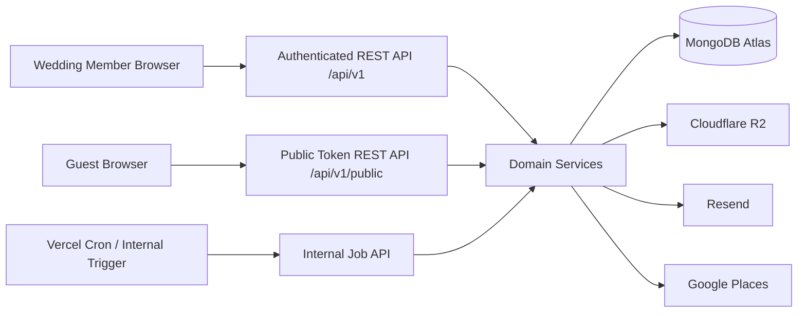

# Make My Marriage

**API Design Document**

**Version:** V1.0  
**Status:** Draft for Review  
**API Style:** REST over HTTPS  
**Backend Runtime:** Next.js Route Handlers on Node.js  
**Language:** TypeScript  
**Validation:** Zod  
**Persistence:** MongoDB Atlas + Mongoose  
**Source Baseline:** PRD V1.1 + System Design Architecture V1 + Database Design V1

---

## 0. Document Control and Alignment

This document defines the V1 HTTP API surface for **Make My Marriage**. It is derived from the approved PRD V1.1, System Design Architecture V1, and Database Design V1. It does not add new product modules or user-facing scope.

Where the source documents intentionally left an API-level contract unspecified, this document makes the smallest implementation recommendation needed to produce a buildable and testable REST API. Such choices are implementation details, not product-scope changes.

### 0.1 Authoritative Constraints Preserved

- Wedding is the tenant/workspace boundary.
- One authenticated User belongs to one Wedding in V1.
- Roles are `ADMIN` and `MANAGER`.
- A Wedding must never have zero Admins.
- Guests never create accounts.
- Guests use secure token-based invitation and gallery links.
- Email ownership verification is not required in V1.
- Business APIs use explicit REST endpoints under `/api/v1`.
- Zod validates path, query, and body input before domain logic runs.
- MongoDB ObjectId strings are internal resource identifiers; public guest flows use opaque capability tokens.
- Media uploads go directly from the client to Cloudflare R2 using signed URLs issued by the API.
- Bulk email returns quickly and is processed by MongoDB-backed lightweight background jobs.
- No Redis, Kafka, RabbitMQ, SQS, WebSockets, product analytics API, billing API, or external monitoring API is introduced in V1.

### 0.2 API-Driven Alignment Correction: Stable Shareable Tokens

The approved product requires Wedding Members to re-share a Guest invitation link and to repeatedly download/share the stable Wedding gallery/QR link. A one-way hash alone cannot reconstruct a previously issued raw token.

Therefore the API needs a retrievable stable share URL. The recommended implementation is:

- Keep a **hash** for fast public token lookup.
- Also retain the same high-entropy raw capability token in **encrypted-at-rest form** using an application encryption key stored in Vercel environment secrets.
- Decrypt the token only for an authorized Wedding Member when the UI requests the existing share URL.
- Never log raw tokens or encrypted token payloads.

This is not a new feature. It is a persistence/security correction required to fulfill already-approved stable invitation sharing and stable gallery/QR behavior. The Database Design should be amended in a future revision to add encrypted token fields for re-displayable Guest invitation and Wedding gallery capabilities.

---

## 1. API Design Goals

The API should be:

1. **Simple to learn and implement** - one versioned REST surface inside the modular monolith.
2. **Tenant-safe by default** - authenticated resources are always resolved inside the current Wedding.
3. **Explicit** - request and response contracts are stable TypeScript/Zod DTOs rather than ad-hoc server actions.
4. **Secure** - server-side sessions, token hashing, role checks, CSRF controls, rate limiting, input allow-lists, and non-leaky errors.
5. **Mobile-friendly** - small payloads, pagination, direct media upload, and login-free Guest APIs.
6. **Retry-safe** - idempotency for bulk email, upload confirmation, and other duplicate-prone operations.
7. **Operationally understandable** - consistent response envelopes, request IDs, logs, job states, and predictable HTTP status codes.

## 2. Non-Goals

The V1 API does not include endpoints for:

- multiple Weddings per User;
- professional planner multi-Wedding switching;
- guest account signup/login;
- granular RBAC/permission management;
- formal budget planning or budget allocation;
- vendor marketplace booking/payment;
- vendor installments/payment schedules;
- accommodation/travel logistics;
- automated WhatsApp/SMS;
- realtime subscriptions/WebSockets;
- in-app notifications;
- product analytics ingestion;
- subscription billing;
- custom video streaming;
- photo moderation approval;
- custom domains.

---

## 3. API Surface Overview



### 3.1 Non-API Web Routes

The following are page routes, not separate REST resource contracts:

```text
/w/<slug>                  Public Wedding website
/invite/<opaque-token>     Guest invitation page
/gallery/<opaque-token>    Private Wedding gallery/upload page
```

These pages may call the REST endpoints described in this document. Public page routes must not expose authenticated Wedding-management data.

---

## 4. Base URL, Versioning and Transport

### 4.1 Base Prefix

```text
/api/v1
```

All business APIs are JSON over HTTPS.

### 4.2 Versioning Rule

V1 follows these rules:

- additive response fields may be introduced without changing `/v1`;
- clients should ignore unknown response fields;
- breaking request/response or semantic changes require a future API version;
- provider-specific changes remain behind server-side adapters and should not change public contracts unnecessarily.

### 4.3 Content Types

```http
Content-Type: application/json
Accept: application/json
```

Direct R2 upload is the exception: the binary goes directly to the signed R2 URL using the MIME type authorized by the upload intent.

---

## 5. Standard Request Lifecycle

```mermaid
flowchart LR
  R[Request] --> RID[Create/propagate requestId]
  RID --> V[Zod path/query/body validation]
  V --> AU[Resolve session or public token]
  AU --> T[Resolve Wedding tenant context]
  T --> RBAC[Role/permission check]
  RBAC --> SV[Domain service]
  SV --> RP[Repository / provider adapter]
  RP --> LG[Structured log]
  LG --> RESP[Standard response envelope]
```



Every state-changing handler follows this order unless it is a public token flow with no authenticated session.

Route Handlers remain thin. They should not contain MongoDB queries, provider-specific logic, or complex business rules directly.

---

## 6. Authentication, Session and Authorization Model

### 6.1 Session-Based Authentication

The API uses a custom opaque server-side session.

- Login/signup creates a high-entropy session token.
- The browser stores the raw token in a secure `HttpOnly` cookie.
- MongoDB stores only the token hash.
- The cookie should be `Secure` in production and use a restrictive `SameSite` policy.
- The exact cookie name and absolute lifetime are configuration details, not product requirements.

### 6.2 Authenticated Tenant Context

For a Wedding-owned request:

```text
session token
  -> Session
  -> User
  -> WeddingMember
  -> weddingId + role
  -> Wedding-scoped query
```

A request that supplies another Wedding's ObjectId must not gain access. Repository lookups use both the resource ID and resolved `weddingId`.

### 6.3 Role Rules

| Operation class | Admin | Manager |
|---|---:|---:|
| Wedding operational data | Yes | Yes |
| Events / Tasks / Guests / Expenses / Vendors | Yes | Yes |
| Website / Gallery / Livestream | Yes | Yes |
| Read operational member summaries | Yes | Yes |
| Invite/revoke Wedding Members | Yes | No |
| Change Wedding Member role | Yes | No |
| Remove Wedding Member | Yes | No |

The final Admin cannot be removed or demoted.

### 6.4 Guest/Public Authorization

Guest invitation and gallery APIs do not accept a caller-supplied `weddingId`.

The public token resolves the Wedding/Guest context server-side:

```text
opaque token -> hash lookup -> authorized Wedding/Guest context
```

Invalid, expired, or revoked capability tokens should fail without revealing unrelated Wedding or Guest information.

---

## 7. Request and Response Conventions

### 7.1 Success Envelope

Single resource:

```json
{
  "data": {
    "id": "66f..."
  },
  "meta": {
    "requestId": "req_01..."
  }
}
```

Collection:

```json
{
  "data": [],
  "meta": {
    "requestId": "req_01...",
    "nextCursor": null,
    "hasMore": false
  }
}
```

`nextCursor` and `hasMore` are returned on cursor-paginated resources. Naturally bounded reference lists such as Wedding Members and Events may return the collection without a cursor.

### 7.2 Error Envelope

```json
{
  "error": {
    "code": "VALIDATION_ERROR",
    "message": "Request validation failed",
    "details": [
      {
        "path": "email",
        "message": "Invalid email"
      }
    ]
  },
  "meta": {
    "requestId": "req_01..."
  }
}
```

### 7.3 Error-Code Style

Machine-readable codes use stable uppercase snake case, for example:

```text
VALIDATION_ERROR
AUTHENTICATION_REQUIRED
FORBIDDEN
RESOURCE_NOT_FOUND
BUSINESS_CONFLICT
DOMAIN_RULE_VIOLATION
RATE_LIMITED
DEPENDENCY_UNAVAILABLE
INTERNAL_ERROR
```

More specific domain codes may be included when the client must handle a known case:

```text
USER_ALREADY_HAS_WEDDING
FINAL_ADMIN_REQUIRED
INVITATION_NOT_ACCEPTABLE
RSVP_EXCEEDS_ALLOWED_GUESTS
EVENT_HAS_DEPENDENCIES
GALLERY_DISABLED
GUEST_UPLOADS_DISABLED
UPLOAD_INTENT_EXPIRED
```

### 7.4 HTTP Status Conventions

| Status | Meaning |
|---:|---|
| 200 | Successful read/update/action with response body |
| 201 | Resource created |
| 202 | Background job accepted |
| 204 | Successful delete/action with no body |
| 400 | Malformed request / invalid JSON |
| 401 | No valid authenticated session |
| 403 | Authenticated but not authorized |
| 404 | Resource not found inside authorized scope, or public token cannot resolve |
| 409 | Business-state conflict such as final Admin or dependency conflict |
| 422 | Domain rule violation after structurally valid input |
| 429 | Rate limited |
| 500 | Unexpected application failure |
| 503 | Critical dependency unavailable and graceful degradation is impossible |

### 7.5 Request ID

Every response includes a request ID. If a safe incoming correlation ID is supported, the API may propagate it; otherwise it creates one server-side.

Never place secrets, raw tokens, signed R2 URLs, passwords, or cookies in the request ID or logs.

---

## 8. Data Format Conventions

### 8.1 IDs

Authenticated resource IDs are MongoDB ObjectId strings:

```text
66f123...
```

Public capability links use opaque tokens and do not expose authorization through ObjectIds alone.

### 8.2 Date and Time

- Wedding, Event, Task due, and Expense dates: `YYYY-MM-DD`.
- Event time fields: `HH:mm`.
- System timestamps: ISO-8601 UTC in API responses.

Example:

```json
{
  "weddingDate": "2027-02-14",
  "createdAt": "2026-09-21T17:00:00.000Z"
}
```

### 8.3 Money

API persistence-facing contracts use integer minor units:

```json
{
  "amountMinor": 18000000,
  "currency": "INR"
}
```

`18000000` paise = INR 180,000.00.

The UI may collect/display rupees, but conversion to safe integer minor units must happen before persistence.

### 8.4 Location

```json
{
  "displayName": "Pune, Maharashtra",
  "formattedAddress": "Pune, Maharashtra, India",
  "city": "Pune",
  "state": "Maharashtra",
  "country": "India",
  "postalCode": "411001",
  "placeId": "google-place-id",
  "coordinates": {
    "type": "Point",
    "coordinates": [73.8567, 18.5204]
  }
}
```

GeoJSON order is `[longitude, latitude]`.

---

## 9. Pagination, Filtering and Sorting

### 9.1 Cursor Pagination

Use cursor pagination for growing collections:

- Guests;
- Tasks where long lists are possible;
- Expenses;
- Vendors if needed;
- Photos/media.

Recommended query convention:

```text
?limit=25&cursor=<opaque-cursor>
```

The cursor is opaque to clients and encodes only server-approved sort keys.

### 9.2 Limit

The exact maximum page size is an implementation configuration, not a product requirement. The API must enforce a safe server-side maximum even if the client requests a larger value.

### 9.3 Allow-Listed Filters

Examples:

| Resource | Allowed filters |
|---|---|
| Tasks | `status`, `priority`, `assignedMemberId`, `eventId`, `mine` |
| Guests | `rsvpStatus`, optional name search |
| Expenses | `category`, `eventId`, `vendorId`, `dateFrom`, `dateTo` |
| Vendors | `category`, optional name search |
| Photos | `eventId`, `kind` |
| Events | optional `dateFrom`, `dateTo` if needed by UI |

Clients never send raw MongoDB filter/update operators.

### 9.4 Sorting

Sort values use an allow-list such as:

```text
createdAt_desc
dueDate_asc
date_desc
name_asc
```

The API maps these values to safe repository sort definitions.

---

## 10. Zod Validation Strategy

Zod is the authoritative HTTP input boundary. Mongoose is a persistence safety net, not the only validation layer.

Validate:

- ObjectId string syntax;
- basic email syntax + normalization;
- enums;
- date-only and time formats;
- latitude `[-90, 90]`;
- longitude `[-180, 180]`;
- positive integer money in minor units;
- RSVP attendee counts;
- bounded ID arrays;
- URL host allow-lists;
- declared upload type/size;
- query filter allow-lists;
- unknown/unsafe nested fields.

Do not pass raw request JSON directly into `Model.find`, `Model.update`, or `$set`.

---

## 11. Common Resource DTOs

These are API-facing resource shapes. Secret hashes and internal encrypted capability-token values are never returned.

### 11.1 UserSummary

```ts
{
  id: string;
  name: string;
  email: string;
}
```

### 11.2 WeddingMemberSummary

```ts
{
  id: string;
  userId: string;
  name: string;
  email: string;
  role: "ADMIN" | "MANAGER";
  joinedAt: string;
}
```

### 11.3 WeddingResource

```ts
{
  id: string;
  brideName: string;
  groomName: string;
  title?: string;
  description?: string;
  weddingDate: string;
  slug: string;
  location: LocationDTO;
  coverMediaId?: string;
  website: {
    theme: string;
    published: boolean;
    welcomeMessage?: string;
  };
  gallery: {
    enabled: boolean;
    guestUploadsEnabled: boolean;
  };
  livestream: {
    youtubeUrl?: string;
  };
  createdAt: string;
  updatedAt: string;
}
```

`gallery.accessTokenHash` and encrypted token material are never returned.

### 11.4 EventResource

```ts
{
  id: string;
  name: string;
  type: EventType;
  date: string;
  startTime?: string;
  endTime?: string;
  venueName?: string;
  address?: string;
  location?: LocationDTO;
  description?: string;
  dressCode?: string;
  coverMediaId?: string;
}
```

### 11.5 TaskResource

```ts
{
  id: string;
  title: string;
  description?: string;
  assignedMemberId?: string;
  eventId?: string;
  dueDate?: string;
  priority: "LOW" | "MEDIUM" | "HIGH";
  status: "TODO" | "IN_PROGRESS" | "COMPLETED";
  createdAt: string;
  updatedAt: string;
}
```

### 11.6 GuestResource

```ts
{
  id: string;
  name: string;
  email?: string;
  phone?: string;
  maxGuestsAllowed: number;
  invitedEventIds: string[];
  rsvpStatus: "PENDING" | "ATTENDING" | "NOT_ATTENDING";
  numberAttending: number;
  notes?: string;
  createdAt: string;
  updatedAt: string;
}
```

### 11.7 ExpenseResource

```ts
{
  id: string;
  title: string;
  amountMinor: number;
  currency: "INR";
  date: string;
  category: string;
  eventId?: string;
  vendorId?: string;
  notes?: string;
}
```

### 11.8 VendorResource

```ts
{
  id: string;
  name: string;
  category: string;
  contactPerson?: string;
  phone?: string;
  email?: string;
  address?: string;
  website?: string;
  totalAgreedCostMinor?: number;
  eventIds: string[];
  notes?: string;
  source: "MANUAL" | "GOOGLE_PLACES";
  googlePlaceId?: string;
  location?: LocationDTO;
}
```

### 11.9 MediaResource

```ts
{
  id: string;
  kind: "WEDDING_COVER" | "EVENT_COVER" | "GALLERY_PHOTO";
  eventId?: string;
  originalFileName: string;
  mimeType: string;
  sizeBytes: number;
  uploadedByType: "MEMBER" | "GUEST";
  createdAt: string;
  readUrl?: string;
  readUrlExpiresAt?: string;
}
```

`readUrl` is short-lived and should not be persisted by the client longer than needed.

---

## 12. Endpoint Catalog

### 12.1 Authentication

| Method | Endpoint | Access | Purpose |
|---|---|---|---|
| POST | `/api/v1/auth/signup` | Public | Create User and authenticated session |
| POST | `/api/v1/auth/login` | Public | Authenticate and create session |
| POST | `/api/v1/auth/logout` | Session | Revoke current session |
| GET | `/api/v1/auth/me` | Session | Current account + membership state |
| POST | `/api/v1/auth/forgot-password` | Public | Send password reset email |
| POST | `/api/v1/auth/reset-password` | Public reset token | Reset password and revoke sessions |

### 12.2 Wedding and Members

| Method | Endpoint | Access | Purpose |
|---|---|---|---|
| POST | `/api/v1/weddings` | Session, no current Wedding | Create Wedding + first Admin |
| GET | `/api/v1/wedding` | Member | Get current Wedding |
| PATCH | `/api/v1/wedding` | Member | Update Wedding details/location |
| GET | `/api/v1/members` | Member | Operational member list |
| POST | `/api/v1/member-invitations` | Admin | Invite Admin/Manager |
| POST | `/api/v1/member-invitations/accept` | Session, no current Wedding | Accept invitation token |
| DELETE | `/api/v1/member-invitations/:id` | Admin | Revoke pending invitation |
| PATCH | `/api/v1/members/:memberId/role` | Admin | Change Admin/Manager role |
| DELETE | `/api/v1/members/:memberId` | Admin | Remove Wedding Member |

### 12.3 Dashboard

| Method | Endpoint | Access | Purpose |
|---|---|---|---|
| GET | `/api/v1/dashboard` | Member | Aggregate current Wedding dashboard cards and upcoming items |

This endpoint is an API-level convenience for an already-approved Dashboard. It does not introduce a new data model; values are computed from indexed source collections.

### 12.4 Events and Tasks

| Method | Endpoint | Access | Purpose |
|---|---|---|---|
| GET | `/api/v1/events` | Member | List Wedding Events |
| POST | `/api/v1/events` | Member | Create Event |
| GET | `/api/v1/events/:eventId` | Member | Read Event |
| PATCH | `/api/v1/events/:eventId` | Member | Update Event |
| DELETE | `/api/v1/events/:eventId` | Member | Delete Event when dependency-safe |
| GET | `/api/v1/tasks` | Member | List/filter Tasks |
| POST | `/api/v1/tasks` | Member | Create Task |
| GET | `/api/v1/tasks/:taskId` | Member | Read Task |
| PATCH | `/api/v1/tasks/:taskId` | Member | Update Task |
| DELETE | `/api/v1/tasks/:taskId` | Member | Delete Task |

### 12.5 Guests, Invitations and RSVP

| Method | Endpoint | Access | Purpose |
|---|---|---|---|
| GET | `/api/v1/guests` | Member | List/filter Guests |
| POST | `/api/v1/guests` | Member | Create Guest party |
| GET | `/api/v1/guests/:guestId` | Member | Read Guest |
| PATCH | `/api/v1/guests/:guestId` | Member | Update Guest |
| DELETE | `/api/v1/guests/:guestId` | Member | Delete Guest + invitation record |
| GET | `/api/v1/guests/:guestId/invitation` | Member | Get invitation status + stable share URL |
| POST | `/api/v1/guests/:guestId/invitation/send` | Member | Send/resend one Guest invitation |
| POST | `/api/v1/invitations/send-bulk` | Member | Queue bulk invitations |
| POST | `/api/v1/invitations/remind-pending` | Member | Queue reminders to Pending Guests |
| GET | `/api/v1/public/invitations/:token` | Public token | Resolve invitation page data |
| PATCH | `/api/v1/public/invitations/:token/rsvp` | Public token | Create/update RSVP |

The `GET .../invitation` support endpoint is required by the approved manual WhatsApp share feature so an organizer can copy/share the existing stable Guest invitation URL.

### 12.6 Expenses

| Method | Endpoint | Access | Purpose |
|---|---|---|---|
| GET | `/api/v1/expenses` | Member | List/filter Expenses |
| POST | `/api/v1/expenses` | Member | Create Expense |
| GET | `/api/v1/expenses/:expenseId` | Member | Read Expense |
| PATCH | `/api/v1/expenses/:expenseId` | Member | Update Expense |
| DELETE | `/api/v1/expenses/:expenseId` | Member | Delete Expense |

### 12.7 Vendors and Discovery

| Method | Endpoint | Access | Purpose |
|---|---|---|---|
| GET | `/api/v1/vendors` | Member | List My Vendors |
| POST | `/api/v1/vendors` | Member | Add manual Vendor |
| GET | `/api/v1/vendors/:vendorId` | Member | Read Vendor |
| PATCH | `/api/v1/vendors/:vendorId` | Member | Update Vendor |
| DELETE | `/api/v1/vendors/:vendorId` | Member | Delete Vendor with controlled Expense cleanup |
| GET | `/api/v1/vendor-discovery` | Member | Search Google Places |
| POST | `/api/v1/vendor-discovery/add` | Member | Add selected Places result to My Vendors |

### 12.8 Wedding Website and Livestream

| Method | Endpoint | Access | Purpose |
|---|---|---|---|
| GET | `/api/v1/website` | Member | Get website/theme settings |
| PATCH | `/api/v1/website` | Member | Update website/theme/content |
| POST | `/api/v1/website/publish` | Member | Publish website |
| POST | `/api/v1/website/unpublish` | Member | Unpublish website |
| GET | `/api/v1/livestream` | Member | Get YouTube config |
| PATCH | `/api/v1/livestream` | Member | Add/update/remove YouTube Live URL |

### 12.9 Gallery and Media

| Method | Endpoint | Access | Purpose |
|---|---|---|---|
| GET | `/api/v1/gallery/settings` | Member | Get gallery settings + share URL |
| PATCH | `/api/v1/gallery/settings` | Member | Update gallery/guest-upload settings |
| GET | `/api/v1/photos` | Member | Paginated Wedding media list |
| DELETE | `/api/v1/photos/:mediaId` | Member | Delete R2 object + metadata |
| POST | `/api/v1/media/upload-intents` | Member | Create member R2 upload intent |
| POST | `/api/v1/media/upload-intents/:uploadId/confirm` | Member | Confirm R2 object + publish media metadata |
| GET | `/api/v1/public/gallery/:token/photos` | Public gallery token | Paginated private gallery |
| POST | `/api/v1/public/gallery/:token/upload-intents` | Public gallery token | Guest R2 upload intent |
| POST | `/api/v1/public/gallery/:token/upload-intents/:uploadId/confirm` | Public gallery token | Confirm Guest upload and publish immediately |

The UI creates/downloads the QR code from the stable gallery share URL; a separate persisted QR resource is unnecessary.

### 12.10 Email Jobs and Internal Processing

| Method | Endpoint | Access | Purpose |
|---|---|---|---|
| GET | `/api/v1/email-jobs/:jobId` | Same-Wedding Member | Read bulk-email progress |
| POST | `/api/v1/internal/jobs/email/process` | Internal secret only | Atomically claim/process next email batch |

---

# 13. Detailed Authentication Contracts

## 13.1 POST `/api/v1/auth/signup`

**Access:** Public  
**Purpose:** Create account and session. No email ownership verification.

Request:

```json
{
  "name": "Bikash Shaw",
  "email": "bikash@example.com",
  "password": "<user-entered-password>"
}
```

Validation:

- name required;
- email basic syntax valid;
- normalize email for lookup/uniqueness;
- email must be globally unique;
- password policy is an implementation/security configuration and must be enforced by Zod/service without exposing the password in logs.

Success `201`:

```json
{
  "data": {
    "user": {
      "id": "66f...",
      "name": "Bikash Shaw",
      "email": "bikash@example.com"
    },
    "weddingState": "NONE",
    "nextActions": ["CREATE_WEDDING", "JOIN_WEDDING"]
  },
  "meta": { "requestId": "req_..." }
}
```

Important:

- sets the secure session cookie;
- does not return a session token in JSON;
- does not send an email verification message.

## 13.2 POST `/api/v1/auth/login`

Request:

```json
{
  "email": "bikash@example.com",
  "password": "<password>"
}
```

Success `200` creates/replaces a session cookie and returns current account/membership summary.

Invalid credentials return a generic authentication error that does not confirm whether the email exists.

## 13.3 POST `/api/v1/auth/logout`

**Access:** Session  
**Idempotent behavior:** repeated logout is safe.

Actions:

1. revoke/delete the current session when present;
2. clear auth cookie;
3. return `204`.

## 13.4 GET `/api/v1/auth/me`

Success:

```json
{
  "data": {
    "user": {
      "id": "66f...",
      "name": "Bikash Shaw",
      "email": "bikash@example.com"
    },
    "membership": {
      "weddingId": "66a...",
      "memberId": "66b...",
      "role": "ADMIN"
    }
  },
  "meta": { "requestId": "req_..." }
}
```

If the User has no Wedding yet, `membership` is `null`.

## 13.5 POST `/api/v1/auth/forgot-password`

Request:

```json
{
  "email": "bikash@example.com"
}
```

Response should be generic regardless of whether the email exists:

```json
{
  "data": {
    "accepted": true
  },
  "meta": { "requestId": "req_..." }
}
```

The backend creates a high-entropy reset token, stores only its hash, and sends the raw token via Resend when the User exists.

## 13.6 POST `/api/v1/auth/reset-password`

Request:

```json
{
  "token": "<opaque-reset-token>",
  "newPassword": "<new-password>"
}
```

On success:

- change `passwordHash`;
- consume/invalidate reset token;
- revoke existing sessions;
- return `200`.

---

# 14. Wedding and Member Contracts

## 14.1 POST `/api/v1/weddings`

**Access:** Authenticated User with no Wedding membership.

Request:

```json
{
  "brideName": "Asha",
  "groomName": "Rohan",
  "weddingDate": "2027-02-14",
  "title": "Asha & Rohan",
  "description": "Optional message",
  "location": {
    "displayName": "Pune, Maharashtra",
    "formattedAddress": "Pune, Maharashtra, India",
    "placeId": "google-place-id",
    "coordinates": {
      "type": "Point",
      "coordinates": [73.8567, 18.5204]
    }
  }
}
```

Server-managed values:

- first Admin membership;
- slug;
- default website settings;
- default gallery settings;
- private gallery capability token;
- timestamps.

Create Wedding + first Admin is one MongoDB transaction.

Success `201` returns the Wedding and current membership.

Conflict `409` if the User already belongs to a Wedding.

## 14.2 GET `/api/v1/wedding`

Returns the current tenant Wedding only.

## 14.3 PATCH `/api/v1/wedding`

Allow-listed mutable fields:

```text
brideName
groomName
title
description
weddingDate
location
coverMediaId
```

Do not accept direct mutation of:

```text
_id
slug after it is stable/shared
website.published through this endpoint
gallery.accessTokenHash
encrypted capability-token fields
createdAt
```

## 14.4 GET `/api/v1/members`

Returns operational member summaries required for task assignment and general Wedding collaboration.

Managers may read the list but cannot mutate membership administration.

## 14.5 POST `/api/v1/member-invitations`

**Access:** Admin only.

Request:

```json
{
  "email": "family@example.com",
  "role": "MANAGER"
}
```

Server actions:

1. normalize email;
2. ensure current caller is Admin;
3. ensure invite state does not violate V1 membership rules;
4. generate secure token;
5. persist hash and lifecycle state;
6. send invitation via Resend;
7. return invitation metadata, never token hash.

Success `201`:

```json
{
  "data": {
    "id": "66i...",
    "email": "family@example.com",
    "role": "MANAGER",
    "status": "PENDING",
    "expiresAt": "2026-10-01T00:00:00.000Z"
  },
  "meta": { "requestId": "req_..." }
}
```

## 14.6 POST `/api/v1/member-invitations/accept`

**Access:** Signed-in User with no Wedding membership.

Request:

```json
{
  "token": "<opaque-member-invite-token>"
}
```

Acceptance rules:

- invitation is pending, valid, unexpired;
- signed-in normalized email matches invited email;
- User has no existing Wedding membership;
- membership creation + invite acceptance occur in one transaction.

Success `200` returns Wedding/membership summary.

## 14.7 DELETE `/api/v1/member-invitations/:id`

**Access:** Admin only.  
**Action:** revoke pending invite.  
**Success:** `204`.

## 14.8 PATCH `/api/v1/members/:memberId/role`

Request:

```json
{
  "role": "ADMIN"
}
```

Server validates the target belongs to the same Wedding. Demoting the final Admin returns `409 FINAL_ADMIN_REQUIRED`.

## 14.9 DELETE `/api/v1/members/:memberId`

Removes only the Wedding membership, not the underlying User account.

If target is the final Admin: `409 FINAL_ADMIN_REQUIRED`.

Database-integrity cleanup for Tasks assigned to the removed membership follows the Database Design policy.

---

# 15. Dashboard Contract

## 15.1 GET `/api/v1/dashboard`

Returns a compact current-Wedding projection computed from indexed queries.

Example:

```json
{
  "data": {
    "countdownDays": 42,
    "events": 6,
    "tasks": {
      "total": 48,
      "completed": 32
    },
    "guests": 186,
    "rsvp": {
      "pending": 54,
      "attending": 120,
      "notAttending": 12
    },
    "totalExpenseMinor": 124500000,
    "currency": "INR",
    "vendors": 8,
    "upcomingEvents": [],
    "upcomingTasks": []
  },
  "meta": { "requestId": "req_..." }
}
```

No analytics/event-tracking side effects occur.

---

# 16. Event Contracts

## 16.1 POST `/api/v1/events`

Request:

```json
{
  "name": "Sangeet",
  "type": "SANGEET",
  "date": "2027-02-12",
  "startTime": "19:00",
  "endTime": "23:00",
  "venueName": "ABC Banquet",
  "address": "Pune, Maharashtra",
  "description": "Music and dance evening",
  "dressCode": "Festive Indian"
}
```

`CUSTOM` type still requires a user-facing `name`.

## 16.2 GET `/api/v1/events`

Events are naturally bounded in V1 and may be returned as one list sorted by date/time. Optional safe date-range filters may be supported.

## 16.3 GET/PATCH `/api/v1/events/:eventId`

Resource resolution is:

```text
{ _id: eventId, weddingId: currentWeddingId }
```

Cross-Wedding IDs behave as not found.

## 16.4 DELETE `/api/v1/events/:eventId`

Before delete, service checks dependent:

- Guest invited event selections;
- Tasks;
- Vendors;
- Expenses;
- Media.

If dependencies exist:

```json
{
  "error": {
    "code": "EVENT_HAS_DEPENDENCIES",
    "message": "Event cannot be deleted until dependent records are resolved",
    "details": [
      { "type": "tasks", "count": 3 },
      { "type": "guests", "count": 17 }
    ]
  },
  "meta": { "requestId": "req_..." }
}
```

Status: `409`.

---

# 17. Task Contracts

## 17.1 POST `/api/v1/tasks`

Request:

```json
{
  "title": "Finalize photographer",
  "description": "Confirm package and timing",
  "assignedMemberId": "66m...",
  "eventId": "66e...",
  "dueDate": "2027-01-15",
  "priority": "HIGH",
  "status": "TODO"
}
```

Cross-document validation ensures `assignedMemberId` and `eventId` belong to the current Wedding.

## 17.2 GET `/api/v1/tasks`

Example filters:

```text
?status=TODO&priority=HIGH&eventId=...&assignedMemberId=...
?mine=true&status=IN_PROGRESS
```

For `mine=true`, the API resolves the current User's `WeddingMember._id` server-side.

## 17.3 PATCH `/api/v1/tasks/:taskId`

Partial update supports the same mutable Task fields. Unknown fields are rejected.

## 17.4 DELETE `/api/v1/tasks/:taskId`

Authorized hard delete. Success `204`.

---

# 18. Guest, Invitation and RSVP Contracts

## 18.1 POST `/api/v1/guests`

Request:

```json
{
  "name": "Rajesh Sharma",
  "email": "rajesh@example.com",
  "phone": "+91XXXXXXXXXX",
  "maxGuestsAllowed": 4,
  "invitedEventIds": ["66event1", "66event2"],
  "notes": "Family friend"
}
```

Server defaults:

```text
rsvpStatus = PENDING
numberAttending = 0
```

All invited Event IDs must belong to the same Wedding.

Implementation detail: the service should ensure the Guest has exactly one stable `guestInvitations` capability record so manual share works even if email is absent.

## 18.2 GET `/api/v1/guests`

Recommended query:

```text
?limit=25&cursor=<opaque>&rsvpStatus=PENDING&search=rajesh
```

Guest email is optional and non-unique.

## 18.3 PATCH `/api/v1/guests/:guestId`

Organizer updates identity/contact, allowance, invited Events, notes, and - where required by management UI - RSVP state.

If `maxGuestsAllowed` is reduced below an already recorded `numberAttending`, reject with `422` until RSVP is resolved deliberately; do not silently truncate attendance.

## 18.4 DELETE `/api/v1/guests/:guestId`

Transactionally delete:

- Guest;
- its one GuestInvitation record.

This invalidates the invitation link.

## 18.5 GET `/api/v1/guests/:guestId/invitation`

**Access:** Wedding Member.

Purpose:

- return send/reminder state;
- return the existing stable invitation URL for copy/manual WhatsApp share;
- never return token hashes.

Example:

```json
{
  "data": {
    "guestId": "66g...",
    "status": "ACTIVE",
    "invitationSentAt": "2026-11-01T10:00:00.000Z",
    "invitationSendCount": 1,
    "lastReminderAt": null,
    "shareUrl": "https://makemymarriage.com/invite/<opaque-token>"
  },
  "meta": { "requestId": "req_..." }
}
```

The service retrieves the encrypted stable token, decrypts it only for this authorized response, constructs the URL, and does not log it.

## 18.6 POST `/api/v1/guests/:guestId/invitation/send`

Send/resend a single invitation through Resend.

Single-recipient send may run synchronously after DB state is safe. The API updates send markers only according to the email service's success/failure policy.

Success `200` returns current invitation delivery state.

## 18.7 POST `/api/v1/invitations/send-bulk`

**Access:** Wedding Member.

Request:

```json
{
  "guestIds": ["66g1", "66g2", "66g3"]
}
```

If the UI wants "all eligible Guests", it may send no explicit IDs and the service can select eligible current-Wedding Guests according to an allow-listed mode:

```json
{
  "selection": "ALL_WITH_EMAIL"
}
```

This selection mode is an API implementation convenience for the approved "Send All Invitations" behavior.

Recommended header:

```http
Idempotency-Key: <client-generated-unique-key>
```

Success `202`:

```json
{
  "data": {
    "jobId": "66job...",
    "status": "PENDING",
    "recipientCount": 500
  },
  "meta": { "requestId": "req_..." }
}
```

The request never waits for 500 emails to be delivered.

## 18.8 POST `/api/v1/invitations/remind-pending`

Queues reminders only for Guests whose current `rsvpStatus` is `PENDING` and who have an email address.

Uses the same `202 + jobId` pattern.

## 18.9 GET `/api/v1/public/invitations/:token`

**Access:** Public opaque capability token.

Returns only invitation-safe data:

```json
{
  "data": {
    "couple": {
      "brideName": "Asha",
      "groomName": "Rohan"
    },
    "weddingDate": "2027-02-14",
    "guest": {
      "name": "Rajesh Sharma",
      "maxGuestsAllowed": 4,
      "rsvpStatus": "PENDING",
      "numberAttending": 0
    },
    "events": [
      {
        "id": "66e...",
        "name": "Wedding",
        "date": "2027-02-14",
        "startTime": "20:00",
        "venueName": "XYZ Resort",
        "address": "Pune"
      }
    ]
  },
  "meta": { "requestId": "req_..." }
}
```

Do not return internal notes, other Guests, member details, expenses, vendors, or unrelated Events.

## 18.10 PATCH `/api/v1/public/invitations/:token/rsvp`

Request:

```json
{
  "rsvpStatus": "ATTENDING",
  "numberAttending": 3
}
```

Rules:

- `ATTENDING` requires `1..maxGuestsAllowed`;
- `PENDING` or `NOT_ATTENDING` stores `numberAttending = 0`;
- every update revalidates max attendance;
- last valid concurrent update wins.

If requested count exceeds allowed count: `422 RSVP_EXCEEDS_ALLOWED_GUESTS`.

---

# 19. Expense Contracts

## 19.1 POST `/api/v1/expenses`

Request:

```json
{
  "title": "Wedding photographer",
  "amountMinor": 18000000,
  "currency": "INR",
  "date": "2027-01-10",
  "category": "PHOTOGRAPHY",
  "eventId": "66e...",
  "vendorId": "66v...",
  "notes": "Full package"
}
```

`eventId` and `vendorId` are optional but, when present, must belong to the same Wedding.

No budget fields are accepted.

## 19.2 GET `/api/v1/expenses`

Example:

```text
?category=PHOTOGRAPHY&vendorId=...&dateFrom=2027-01-01&dateTo=2027-02-28
```

Response may include page-level totals only if they are clearly distinguished from total Wedding expense. The dashboard/global total comes from its dedicated aggregate query.

## 19.3 DELETE `/api/v1/expenses/:expenseId`

Hard delete when authorized. Success `204`.

---

# 20. Vendor and Discovery Contracts

## 20.1 POST `/api/v1/vendors`

Manual Vendor request:

```json
{
  "name": "Pixel Photography",
  "category": "PHOTOGRAPHER",
  "contactPerson": "Arjun",
  "phone": "+91XXXXXXXXXX",
  "email": "hello@example.com",
  "address": "Pune",
  "website": "https://example.com",
  "totalAgreedCostMinor": 20000000,
  "eventIds": ["66e1", "66e2"],
  "notes": "Drone included"
}
```

Server sets `source = MANUAL`.

## 20.2 GET `/api/v1/vendor-discovery`

Example default Wedding-location search:

```text
/api/v1/vendor-discovery?category=PHOTOGRAPHER
```

Override location for one search:

```text
/api/v1/vendor-discovery?category=PHOTOGRAPHER&lat=19.0760&lng=72.8777
```

Rules:

- if override coordinates are absent, use saved Wedding location;
- override does not mutate Wedding Details;
- backend calls Google Places through an integration adapter;
- provider response is normalized before returning.

Example normalized result:

```json
{
  "placeId": "google-place-id",
  "name": "Example Studio",
  "rating": 4.6,
  "address": "Pune, Maharashtra",
  "location": {
    "lat": 18.52,
    "lng": 73.85
  }
}
```

Provider-specific fields not used by V1 should not leak into the domain contract unnecessarily.

## 20.3 POST `/api/v1/vendor-discovery/add`

Request:

```json
{
  "placeId": "google-place-id",
  "category": "PHOTOGRAPHER",
  "eventIds": ["66e..."]
}
```

The backend retrieves/normalizes the Places record and creates a Vendor with `source = GOOGLE_PLACES`.

## 20.4 DELETE `/api/v1/vendors/:vendorId`

Expense history must not be deleted. The service applies the approved controlled cleanup for optional `expenses.vendorId` references, then hard-deletes the Vendor.

---

# 21. Wedding Website and Livestream Contracts

## 21.1 GET `/api/v1/website`

Returns current Wedding website configuration and stable public slug/URL.

Example:

```json
{
  "data": {
    "slug": "asha-rohan-2027-02-14",
    "publicUrl": "https://makemymarriage.com/w/asha-rohan-2027-02-14",
    "theme": "MINIMAL_ELEGANT",
    "published": false,
    "welcomeMessage": "Welcome to our celebration"
  },
  "meta": { "requestId": "req_..." }
}
```

## 21.2 PATCH `/api/v1/website`

Request:

```json
{
  "theme": "CLASSIC_INDIAN",
  "welcomeMessage": "We would love to celebrate with you"
}
```

Allowed theme values are the approved predefined V1 themes. No drag-and-drop layout payload exists.

## 21.3 POST `/api/v1/website/publish`

Sets `website.published = true`. Slug remains stable once shared/published.

## 21.4 POST `/api/v1/website/unpublish`

Sets `website.published = false` without deleting website configuration.

## 21.5 GET/PATCH `/api/v1/livestream`

PATCH request:

```json
{
  "youtubeUrl": "https://www.youtube.com/watch?v=..."
}
```

To remove livestream:

```json
{
  "youtubeUrl": null
}
```

The backend allow-lists accepted YouTube hosts/patterns. Raw iframe HTML is never accepted.

---

# 22. Gallery and Media Contracts

## 22.1 GET `/api/v1/gallery/settings`

Returns safe organizer settings plus stable share URL:

```json
{
  "data": {
    "enabled": true,
    "guestUploadsEnabled": true,
    "shareUrl": "https://makemymarriage.com/gallery/<opaque-token>",
    "qrPayload": "https://makemymarriage.com/gallery/<opaque-token>"
  },
  "meta": { "requestId": "req_..." }
}
```

The UI may render/download a QR from `qrPayload`. No QR binary needs to be persisted in MongoDB.

## 22.2 PATCH `/api/v1/gallery/settings`

Request:

```json
{
  "enabled": true,
  "guestUploadsEnabled": true
}
```

No complex photo permission matrix exists.

## 22.3 GET `/api/v1/photos`

Example:

```text
?limit=30&cursor=<opaque>&eventId=66e...&kind=GALLERY_PHOTO
```

Each media row may contain a short-lived signed `readUrl`. The R2 object key is not required by the browser and should not be used as authorization.

## 22.4 POST `/api/v1/media/upload-intents`

**Access:** Wedding Member.

Request:

```json
{
  "fileName": "IMG_1234.jpg",
  "mimeType": "image/jpeg",
  "declaredSizeBytes": 5242880,
  "kind": "GALLERY_PHOTO",
  "eventId": "66e..."
}
```

The API:

1. validates MIME type/declared size/kind/event ownership;
2. generates R2 object key server-side;
3. creates short-lived `mediaUploadIntent`;
4. returns a short-lived signed R2 upload URL.

Success `201`:

```json
{
  "data": {
    "uploadId": "66u...",
    "uploadUrl": "https://<signed-r2-url>",
    "method": "PUT",
    "headers": {
      "Content-Type": "image/jpeg"
    },
    "expiresAt": "2026-09-21T18:10:00.000Z"
  },
  "meta": { "requestId": "req_..." }
}
```

The signed URL must not be logged.

## 22.5 Direct R2 PUT

This is not a Make My Marriage API endpoint.

```text
Browser --PUT binary--> signed Cloudflare R2 URL
```

The binary does not pass through Next.js/Vercel.

## 22.6 POST `/api/v1/media/upload-intents/:uploadId/confirm`

The server verifies the expected object exists and metadata matches the intent before creating `mediaAssets`.

Repeated confirmation is idempotent and must not create duplicate media rows.

## 22.7 DELETE `/api/v1/photos/:mediaId`

Idempotent permanent deletion workflow:

1. authorize same-Wedding member;
2. delete R2 object when present;
3. delete metadata;
4. safely tolerate retry after partial failure.

## 22.8 GET `/api/v1/public/gallery/:token/photos`

**Access:** valid Wedding gallery token.

Rules:

- gallery must be enabled;
- token alone determines Wedding;
- response includes only gallery-safe media and Event labels/IDs needed for albums;
- private signed read URLs are short-lived.

## 22.9 POST `/api/v1/public/gallery/:token/upload-intents`

Guest request is similar to Member upload intent but:

- gallery must be enabled;
- guest uploads must be enabled;
- rate controls are stricter;
- uploader type is `GUEST`;
- if an Event is selected, it must belong to the resolved Wedding.

## 22.10 POST `/api/v1/public/gallery/:token/upload-intents/:uploadId/confirm`

After successful object validation:

```text
mediaAssets created -> photo immediately visible
```

There is no moderation state.

---

# 23. Email Job Contracts

## 23.1 GET `/api/v1/email-jobs/:jobId`

Same-Wedding Member only.

Example:

```json
{
  "data": {
    "id": "66job...",
    "type": "GUEST_INVITATION",
    "status": "PROCESSING",
    "recipientCount": 500,
    "processedCount": 150,
    "successCount": 147,
    "failureCount": 3,
    "createdAt": "2026-09-21T17:00:00.000Z",
    "updatedAt": "2026-09-21T17:01:00.000Z"
  },
  "meta": { "requestId": "req_..." }
}
```

Do not expose internal provider errors containing secrets or Guest PII unnecessarily.

## 23.2 POST `/api/v1/internal/jobs/email/process`

**Access:** internal secret only; never browser-authenticated.

Typical behavior:

```text
atomic claim next eligible job
  -> set PROCESSING + lockedUntil
  -> send small configurable recipient batch through Resend
  -> persist counts/cursor/failure state
  -> COMPLETED / PARTIAL_FAILURE / retry state
```

Response may return only operational batch summary.

Two processors waking simultaneously must not double-claim the same active lease.

---

# 24. Idempotency and Retry Design

### 24.1 Client Idempotency Header

Duplicate-prone write operations may accept:

```http
Idempotency-Key: <unique-client-key>
```

Required/recommended for:

- bulk invitation creation;
- bulk reminder creation.

Server may reuse the existing job response when the same Wedding + key is replayed.

### 24.2 Upload Confirmation

Idempotency is enforced by the unique R2 object key and upload-intent state.

### 24.3 Public RSVP

RSVP is naturally updateable. Repeated identical valid requests return the resulting Guest RSVP state.

### 24.4 Delete Endpoints

Task/Expense deletes may return `404` after already deleted; media deletion should specifically tolerate partial R2/DB retry so it reaches a consistent final state.

---

# 25. Rate Limiting

V1 uses a lightweight MongoDB-backed rate-limit implementation because Redis is intentionally absent.

Sensitive flows include:

- signup;
- login;
- forgot/reset password;
- member-invitation acceptance;
- public invitation token resolution;
- RSVP mutation;
- public gallery resolution;
- guest upload-intent creation.

The exact numeric thresholds are security configuration, not PRD requirements, and should be environment-configurable.

Rate-limit error:

```json
{
  "error": {
    "code": "RATE_LIMITED",
    "message": "Too many requests"
  },
  "meta": { "requestId": "req_..." }
}
```

Status: `429`.

---

# 26. Security Controls at the API Boundary

## 26.1 CSRF

Authenticated state-changing requests use same-origin cookies plus Origin/Referer validation where applicable. The API should not treat `SameSite` alone as the only security control.

## 26.2 NoSQL Injection

- Zod strips/rejects unexpected fields.
- No raw `$` operators from clients.
- Repository code builds queries explicitly.

## 26.3 Cross-Wedding IDOR Defence

Never:

```ts
Task.findById(taskId)
```

Use tenant scope:

```ts
Task.findOne({ _id: taskId, weddingId: ctx.weddingId })
```

## 26.4 Capability Tokens

Never log:

```text
session tokens
password-reset tokens
member invitation tokens
guest invitation tokens
gallery tokens
R2 signed URLs
```

## 26.5 File Upload Security

Upload intent validates:

- accepted MIME types;
- declared size against configured limit;
- actor permission/token;
- Event ownership where selected;
- server-generated object key;
- gallery/guest-upload enabled state.

Confirmation re-checks observable object metadata before permanent publication.

## 26.6 External URL Validation

- YouTube URLs: host/pattern allow-list.
- Vendor website field: URL validation as normal data.
- Google Places requests are built server-side; clients cannot supply arbitrary provider request JSON.

---

# 27. Error Mapping Matrix

| Scenario | Status | Code |
|---|---:|---|
| Invalid Zod input | 400/422 | `VALIDATION_ERROR` |
| No session | 401 | `AUTHENTICATION_REQUIRED` |
| Manager attempts Admin-only mutation | 403 | `FORBIDDEN` |
| Cross-Wedding ObjectId | 404 | `RESOURCE_NOT_FOUND` |
| User already has Wedding | 409 | `USER_ALREADY_HAS_WEDDING` |
| Remove/demote final Admin | 409 | `FINAL_ADMIN_REQUIRED` |
| Duplicate active member invitation | 409 | `BUSINESS_CONFLICT` |
| Invalid/expired public token | 404 | `RESOURCE_NOT_FOUND` |
| RSVP exceeds max | 422 | `RSVP_EXCEEDS_ALLOWED_GUESTS` |
| Event has dependencies | 409 | `EVENT_HAS_DEPENDENCIES` |
| Gallery disabled | 404/422 depending route semantics | `GALLERY_DISABLED` |
| Guest uploads disabled | 403/422 | `GUEST_UPLOADS_DISABLED` |
| Upload intent expired | 409/422 | `UPLOAD_INTENT_EXPIRED` |
| Rate limit exceeded | 429 | `RATE_LIMITED` |
| Google Places unavailable | 503 for discovery request | `DEPENDENCY_UNAVAILABLE` |
| Resend failure on single send | 503 or action-specific failure | `DEPENDENCY_UNAVAILABLE` |
| Unexpected server failure | 500 | `INTERNAL_ERROR` |

For security-sensitive public token flows, prefer non-enumerating responses.

---

# 28. External Provider Failure Behavior

### 28.1 Resend

- Single email: return a controlled provider failure if send cannot be accepted.
- Bulk email: job remains/retries according to job state; client API remains `202` after successful job creation.

### 28.2 Google Places

If unavailable:

- `Discover Vendors` may return `503`;
- `My Vendors` CRUD remains fully functional.

### 28.3 Cloudflare R2

If signed upload generation fails, return controlled dependency error. If R2 read is unavailable, gallery metadata may still resolve but media cannot load; do not expose bucket internals.

### 28.4 YouTube

YouTube playback failure does not make the Wedding website API unavailable.

---

# 29. Logging and API Observability

No external monitoring product is required initially.

For API requests log structured fields such as:

```json
{
  "timestamp": "...",
  "level": "info",
  "requestId": "req_...",
  "userId": "...",
  "weddingId": "...",
  "method": "PATCH",
  "route": "/api/v1/public/invitations/:token/rsvp",
  "action": "guest.rsvp.updated",
  "status": 200,
  "durationMs": 42
}
```

Do not put the raw token in the logged route/path. Normalize sensitive route parameters before logging.

---

# 30. API Performance Rules

Engineering targets, not contractual SLAs:

- ordinary indexed CRUD should generally complete within sub-second server time excluding third-party latency;
- bulk email endpoints return `202` quickly;
- large image bytes bypass Vercel;
- all growing list endpoints use pagination;
- responses use projections and avoid large unused fields;
- public website/gallery reads may use appropriate caching only when authorization/privacy remains correct;
- authenticated tenant data is never placed in shared public caches.

---

# 31. Next.js Route Handler Mapping

Suggested route tree:

```text
src/app/api/v1/
  auth/
    signup/route.ts
    login/route.ts
    logout/route.ts
    me/route.ts
    forgot-password/route.ts
    reset-password/route.ts

  weddings/route.ts
  wedding/route.ts
  dashboard/route.ts

  members/route.ts
  members/[memberId]/role/route.ts
  members/[memberId]/route.ts
  member-invitations/route.ts
  member-invitations/accept/route.ts
  member-invitations/[id]/route.ts

  events/route.ts
  events/[eventId]/route.ts
  tasks/route.ts
  tasks/[taskId]/route.ts

  guests/route.ts
  guests/[guestId]/route.ts
  guests/[guestId]/invitation/route.ts
  guests/[guestId]/invitation/send/route.ts
  invitations/send-bulk/route.ts
  invitations/remind-pending/route.ts

  expenses/route.ts
  expenses/[expenseId]/route.ts

  vendors/route.ts
  vendors/[vendorId]/route.ts
  vendor-discovery/route.ts
  vendor-discovery/add/route.ts

  website/route.ts
  website/publish/route.ts
  website/unpublish/route.ts
  livestream/route.ts

  gallery/settings/route.ts
  photos/route.ts
  photos/[mediaId]/route.ts
  media/upload-intents/route.ts
  media/upload-intents/[uploadId]/confirm/route.ts

  public/
    invitations/[token]/route.ts
    invitations/[token]/rsvp/route.ts
    gallery/[token]/photos/route.ts
    gallery/[token]/upload-intents/route.ts
    gallery/[token]/upload-intents/[uploadId]/confirm/route.ts

  email-jobs/[jobId]/route.ts
  internal/jobs/email/process/route.ts
```

Route files should delegate to module services and repositories rather than importing Mongoose models directly where avoidable.

---

# 32. Suggested API Module Layout

```text
src/modules/guests/
  guest.schemas.ts       Zod request/query/response DTOs
  guest.service.ts       domain orchestration
  guest.repository.ts    Wedding-scoped persistence
  guest.model.ts         Mongoose schema
  guest.errors.ts        stable domain error codes

src/shared/api/
  response.ts
  errors.ts
  request-id.ts
  pagination.ts
  idempotency.ts

src/shared/auth/
  session.ts
  require-session.ts
  tenant-context.ts
  require-role.ts

src/integrations/
  resend/
  r2/
  google-places/
```

---

# 33. Testing Strategy

## 33.1 Contract/Unit Tests

Test Zod contracts for:

- valid/invalid IDs;
- unknown fields;
- email normalization;
- location coordinate ranges;
- money integers;
- RSVP constraints;
- enum allow-lists;
- provider URL allow-lists;
- upload metadata.

## 33.2 API Integration Tests

Required cases include:

1. signup creates session;
2. duplicate email rejected;
3. create Wedding creates first Admin atomically;
4. User cannot create second Wedding;
5. Manager cannot mutate Wedding Members;
6. final Admin cannot be removed/demoted;
7. cross-Wedding ObjectId lookup rejected;
8. Event delete dependency conflict;
9. Guest invite link resolves only invited Events;
10. RSVP cannot exceed allowed count;
11. expense/vendor/event references must be same-Wedding;
12. Google Places override does not mutate Wedding location;
13. signed upload intent cannot target another Wedding's Event;
14. duplicate media confirmation creates one media row;
15. Guest upload publishes immediately;
16. bulk send returns 202 and job progress is readable;
17. internal job endpoint requires internal secret;
18. public tokens are not logged;
19. gallery disabled/guest uploads disabled behavior;
20. rate-limit behavior on sensitive endpoints.

## 33.3 End-to-End Flows

Recommended Playwright E2E:

```text
Signup -> Create Wedding -> Event -> Task -> Guest -> Send Invitation -> RSVP
Signup/Login -> Accept Member Invitation -> Join Wedding
Admin -> copy Guest link -> manual WhatsApp share action
Guest -> gallery token -> R2 upload intent -> direct upload -> confirm -> photo visible
Organizer -> delete photo
Bulk invite -> email job -> processor -> completed
```

---

# 34. API Change Management

Before changing an existing contract:

1. verify the PRD if behavior changes;
2. verify System Design if architecture/security flow changes;
3. verify Database Design if persisted shape/index/transaction changes;
4. make additive changes where possible;
5. update Zod contracts and tests together;
6. document breaking changes before introducing a future API version.

---

# 35. API Readiness Checklist

- [ ] Every authenticated Wedding resource resolves through TenantContext.
- [ ] Admin-only endpoints enforce role server-side.
- [ ] Final Admin protection is transaction-tested.
- [ ] Public Guest/Gallery APIs never accept a free-form weddingId.
- [ ] Zod validates every path/query/body.
- [ ] Unknown Mongo operators/unsafe fields are rejected.
- [ ] All list endpoints are bounded/paginated where needed.
- [ ] Response envelope is consistent.
- [ ] Stable error codes exist for client-handled domain cases.
- [ ] Secure session cookie is HttpOnly/Secure in production.
- [ ] CSRF/origin checks protect same-origin cookie mutations.
- [ ] No email verification endpoint/workflow was accidentally added.
- [ ] Guest and gallery stable share URLs can be securely re-displayed without logging raw tokens.
- [ ] R2 signed upload URLs are short-lived and never logged.
- [ ] Upload confirmation is idempotent.
- [ ] Guest photo confirmation has no moderation state.
- [ ] Bulk email returns `202` + jobId.
- [ ] Email processor uses atomic claim/lease.
- [ ] Rate limits cover auth, public tokens, RSVP, and guest uploads.
- [ ] Provider failures degrade only the affected feature.
- [ ] No product analytics/billing/realtime API has been introduced.
- [ ] API integration and security regression tests pass before production.

---

# Appendix A - Enum Catalog

| Enum | Values |
|---|---|
| WeddingMemberRole | `ADMIN`, `MANAGER` |
| EventType | `ROKA`, `ENGAGEMENT`, `MEHENDI`, `HALDI`, `SANGEET`, `COCKTAIL`, `WEDDING`, `RECEPTION`, `CUSTOM` |
| TaskPriority | `LOW`, `MEDIUM`, `HIGH` |
| TaskStatus | `TODO`, `IN_PROGRESS`, `COMPLETED` |
| GuestRsvpStatus | `PENDING`, `ATTENDING`, `NOT_ATTENDING` |
| MemberInvitationStatus | `PENDING`, `ACCEPTED`, `REVOKED`, `EXPIRED` |
| GuestInvitationStatus | `ACTIVE`, `REVOKED`, `EXPIRED` |
| VendorSource | `MANUAL`, `GOOGLE_PLACES` |
| MediaKind | `WEDDING_COVER`, `EVENT_COVER`, `GALLERY_PHOTO` |
| UploadedByType | `MEMBER`, `GUEST` |
| EmailJobStatus | `PENDING`, `PROCESSING`, `COMPLETED`, `PARTIAL_FAILURE`, `FAILED` |
| EmailJobType | `GUEST_INVITATION`, `RSVP_REMINDER`, `MEMBER_INVITE`, `ANNOUNCEMENT` |

# Appendix B - Standard Headers

Authenticated browser request example:

```http
PATCH /api/v1/tasks/66task HTTP/1.1
Host: makemymarriage.com
Content-Type: application/json
Accept: application/json
Cookie: <HttpOnly session cookie automatically sent by browser>
```

Bulk request:

```http
POST /api/v1/invitations/send-bulk HTTP/1.1
Content-Type: application/json
Idempotency-Key: 7d2f...
```

Internal job request:

```http
POST /api/v1/internal/jobs/email/process HTTP/1.1
Authorization: Bearer <internal-secret>
```

The exact internal-secret header convention may be changed as an implementation detail, but browser sessions must never authorize internal job endpoints.

# Appendix C - Source of Truth Order

When there is a conflict, use this order:

1. **PRD V1.1** - product behavior and scope.
2. **System Design Architecture V1** - architecture/security/runtime decisions.
3. **Database Design V1** - persistence shapes, indexes, transactions and lifecycle.
4. **API Design V1** - HTTP contracts that implement the above.

Any future change that modifies product behavior should update the PRD first rather than silently changing the API.
