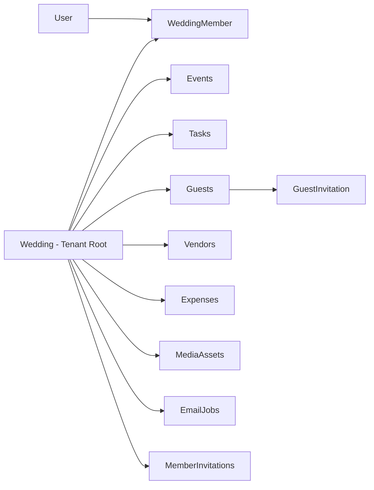
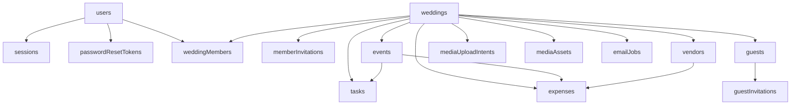
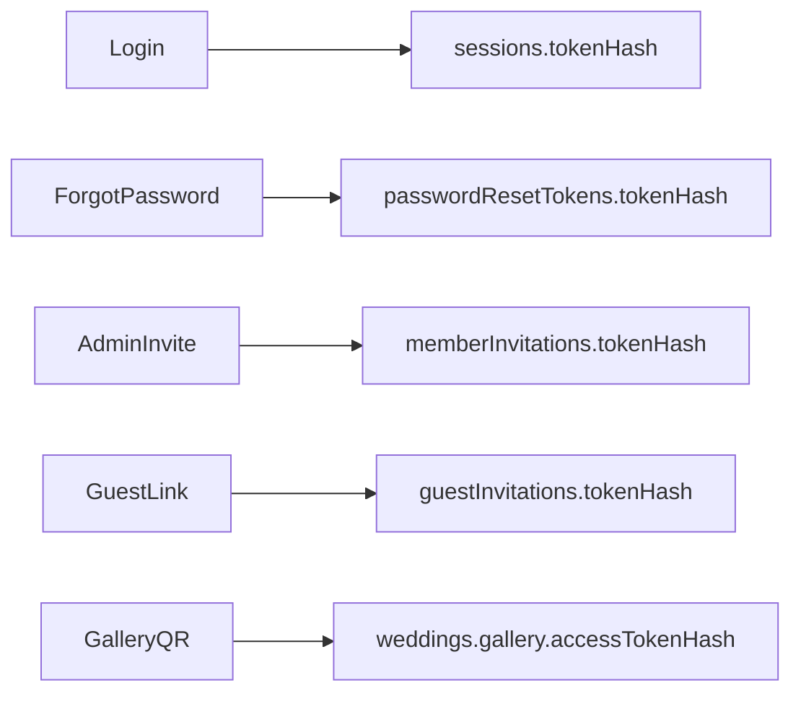
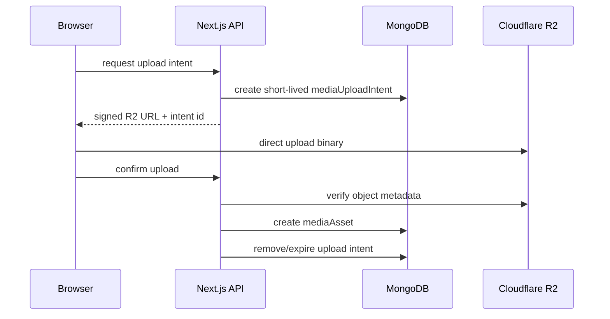
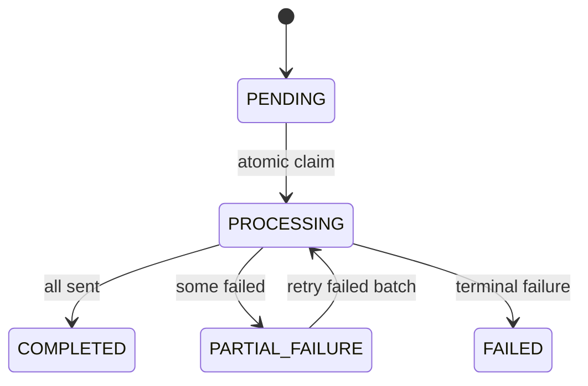

# Make My Marriage

**Database Design Document**

**Version:** V1.0  
**Status:** Draft for Review  
**Database:** MongoDB Atlas  
**ODM:** Mongoose  
**Request Validation:** Zod  
**Source Baseline:** Make My Marriage PRD V1.1 + System Design Architecture V1

---

## 0. Document Control and Alignment

This document defines the V1 database design for **Make My Marriage**. It is derived from the approved/reconciled PRD V1.1 and the approved System Design Architecture V1. It does **not** introduce new product modules or user-facing scope.

Where the System Design intentionally left a database-level implementation detail open, this document makes the smallest implementation recommendation needed to produce a buildable schema. Those recommendations are explicitly identified as database implementation details rather than product requirements.

### 0.1 Authoritative Product Constraints Preserved

- Wedding is the tenant/workspace boundary.
- One authenticated User belongs to only one Wedding in V1.
- One Wedding may have multiple Admins and Managers.
- A Wedding must never have zero Admins.
- Guests never create accounts and use secure token-based links.
- Email ownership verification is not required in V1; email syntax validation and uniqueness still apply to Users.
- Expense tracking is not a formal budgeting system.
- Photo binaries live in Cloudflare R2; MongoDB stores media metadata only.
- Guest-uploaded photos publish immediately after validation; no moderation queue exists.
- Bulk email uses MongoDB-backed lightweight jobs in small batches.
- No Redis, message broker, realtime event system, product analytics store, billing store, or in-app notification center is introduced in V1.

### 0.2 Small Alignment Clarification

The PRD V1.1 treats `Wedding.title` as optional. The earlier System Design example schema displayed it as required. This database design follows the **PRD source of truth** and models `title` as optional. This is a schema correction for alignment, not a product-scope change.

---

## 1. Database Design Goals

The database must make the most important product invariants difficult to violate accidentally:

1. Strong Wedding-level tenant isolation.
2. Exactly one Wedding membership per authenticated User in V1.
3. At least one Admin per Wedding at all times.
4. Secure hashed tokens for sessions, password resets, member invitations, guest invitations, and gallery access.
5. Efficient indexed access for Guests, Tasks, Events, Expenses, Vendors, Gallery metadata, and dashboard counts.
6. Direct-to-R2 media architecture without storing image binaries in MongoDB.
7. Lightweight asynchronous email processing without dedicated queue infrastructure.
8. Simple schema evolution suitable for a learning-oriented modular monolith deployed on Vercel.

## 2. Technology and Persistence Decisions

| Area | Decision |
|---|---|
| Database service | MongoDB Atlas managed by MongoDB |
| ODM | Mongoose |
| Validation | Zod at API boundary + Mongoose schema validation at persistence boundary |
| Tenant key | `weddingId` on all Wedding-owned collections |
| IDs | MongoDB `ObjectId` |
| Dates/timestamps | UTC BSON `Date` for timestamps; ISO date-only strings (`YYYY-MM-DD`) for Wedding/Event/Expense/Due dates |
| Money | Integer minor units (`amountMinor`, paise for INR); never floating rupee values |
| Media binaries | Cloudflare R2 only |
| Transactions | Only for multi-document invariants |
| Backups | MongoDB Atlas managed production backups |
| Schema migrations | Version-controlled explicit scripts; no uncontrolled production auto-indexing |

### 2.1 Why ISO Date-Only Strings for Wedding Domain Dates

Wedding dates, event dates, expense dates and due dates are fundamentally **calendar dates entered by the organizer**, not server timestamps. Storing them as `YYYY-MM-DD` strings avoids accidental timezone shifts while preserving natural sorting. System timestamps such as `createdAt`, `expiresAt`, `acceptedAt`, and `lastSeenAt` remain UTC BSON `Date` values.

V1 does not add a new timezone product requirement beyond the PRD.

---

## 3. MongoDB Modelling Principles

### 3.1 Wedding-First Tenant Scoping

Every operational query for authenticated Wedding data must be scoped by `weddingId`. Resource IDs alone are never sufficient authorization.

```text
Authenticated User
      -> WeddingMember
      -> weddingId + role
      -> query { _id: resourceId, weddingId }
```

This prevents cross-Wedding IDOR even if another Wedding's ObjectId is discovered.

### 3.2 Embed Small Configuration; Reference Growing Aggregates

Embed data that is small, bounded, and owned only by the Wedding record:

- website settings;
- gallery settings;
- livestream URL;
- structured location value object.

Use separate collections for data that grows independently or needs its own indexing/pagination:

- Events;
- Tasks;
- Guests;
- Invitations;
- Expenses;
- Vendors;
- Media metadata;
- Email jobs.

### 3.3 Bounded Arrays Only

Arrays embedded in domain documents must remain naturally bounded:

- `Guest.invitedEventIds` - bounded by Wedding event count;
- `Vendor.eventIds` - bounded by Wedding event count;
- `EmailJob.recipientIds` - bounded by the current V1 planning assumption (~1,000 recipients).

Do not embed unbounded photo lists, task lists, guest lists, or expense histories inside the Wedding document.

### 3.4 No Soft-Delete-Everywhere

V1 uses domain-specific hard-delete behavior. No universal `deletedAt` field is added to every collection.

---

## 4. Tenant and Ownership Model



The **Wedding** record is not just another entity; it is the isolation boundary. All Wedding-owned collections carry `weddingId` even where a relationship could theoretically be inferred through another document. This denormalized ownership key is intentional because it makes authorization and indexed filtering straightforward.

---

## 5. Collection Inventory

| Collection | Purpose | Scope |
|---|---|---|
| users | Global account identity and password hash | Global |
| sessions | Opaque server-side sessions | Global |
| passwordResetTokens | One-time password reset tokens | Global |
| weddings | Tenant root and Wedding configuration | Tenant root |
| weddingMembers | User-to-Wedding membership and role | Wedding |
| memberInvitations | Pending/accepted Admin/Manager join invitations | Wedding |
| events | Wedding events | Wedding |
| tasks | Planning tasks | Wedding |
| guests | Guest party records and RSVP state | Wedding |
| guestInvitations | Guest invitation token and send state | Wedding |
| expenses | Expense tracker | Wedding |
| vendors | Selected/booked vendors | Wedding |
| mediaUploadIntents | Short-lived direct-to-R2 upload authorization records | Wedding (technical) |
| mediaAssets | Permanent R2 metadata for covers and gallery photos | Wedding |
| emailJobs | Lightweight MongoDB-backed bulk email jobs | Wedding |
| rateLimitBuckets | Short-lived security throttling buckets | Key-scoped technical |

### 5.1 Intentionally Absent Collections

No V1 collections are created for:

- product analytics;
- billing/subscriptions;
- formal budgets or budget allocations;
- vendor payment schedules;
- accommodation/travel logistics;
- in-app notifications;
- realtime presence/events;
- photo moderation;
- WhatsApp/SMS automation.

The top-level Notifications product area is implemented through approved email flows and `emailJobs`, not an in-app notification-center database.

---

## 6. Shared Types, Naming and Conventions

### 6.1 Collection and Model Naming

- MongoDB collections: plural camelCase, e.g. `weddingMembers`, `guestInvitations`.
- Mongoose models: singular PascalCase, e.g. `WeddingMember`, `GuestInvitation`.
- Foreign keys: `<entity>Id`, always an `ObjectId`.
- Tenant key: exactly `weddingId`.
- Hashed secrets: suffix `Hash` (`tokenHash`, `accessTokenHash`).
- Monetary minor units: suffix `Minor`.

### 6.2 Location Value Object

```ts
{
  displayName: string,
  formattedAddress?: string,
  city?: string,
  state?: string,
  country?: string,
  postalCode?: string,
  placeId?: string,
  coordinates: {
    type: "Point",
    coordinates: [longitude, latitude]
  }
}
```

GeoJSON order is **longitude first, latitude second**.

### 6.3 Common Timestamp Policy

Use Mongoose `timestamps: true` for mutable collections unless the collection has an intentionally minimal lifecycle. All timestamps are UTC.

### 6.4 Enum Storage

Persist stable uppercase enum codes rather than UI labels. UI copy can change without a migration.

---

## 7. Logical Relationship Overview



---

## 8. Detailed Collection Designs

### 8.1 `users`

**Purpose:** Stores authenticated Wedding Member accounts. Guests are never stored here.

| Field | Type | Required | Meaning |
|---|---|---|---|
| _id | ObjectId | Yes | Primary key. |
| name | String | Yes | Wedding Member display name. |
| email | String | Yes | Original/canonical email value used for display and delivery. |
| emailNormalized | String | Yes | Trimmed lowercase email used for login and uniqueness. |
| passwordHash | String | Yes | Password hash only; never store plaintext password. |
| createdAt | Date | Yes | UTC timestamp. |
| updatedAt | Date | Yes | UTC timestamp. |

**Indexes**

- `UNIQUE { emailNormalized: 1 }`

**Rules / invariants**

- Basic email syntax is validated by Zod before persistence.
- No emailVerified / emailVerifiedAt field exists in V1 because ownership verification is intentionally omitted.
- Authentication errors must not expose whether an email exists.

### 8.2 `sessions`

**Purpose:** Stores opaque server-side login sessions. The raw session token exists only in the secure cookie; MongoDB stores its hash.

| Field | Type | Required | Meaning |
|---|---|---|---|
| _id | ObjectId | Yes | Primary key. |
| userId | ObjectId -> users | Yes | Authenticated account. |
| tokenHash | String | Yes | Hash of the random opaque session token. |
| expiresAt | Date | Yes | Absolute session expiry. |
| createdAt | Date | Yes | Creation time. |
| lastSeenAt | Date | Yes | Optional operational activity marker; update sparingly. |

**Indexes**

- `UNIQUE { tokenHash: 1 }`
- `TTL { expiresAt: 1 } with expireAfterSeconds: 0`
- `{ userId: 1 }`

**Rules / invariants**

- Logout deletes/revokes the current session.
- Successful password reset revokes existing sessions for the user.
- Do not log raw session tokens or token hashes.

### 8.3 `passwordResetTokens`

**Purpose:** Stores short-lived, one-time password-reset credentials. This is an authentication recovery mechanism, not email verification.

| Field | Type | Required | Meaning |
|---|---|---|---|
| _id | ObjectId | Yes | Primary key. |
| userId | ObjectId -> users | Yes | Account being reset. |
| tokenHash | String | Yes | Hash of the high-entropy reset token emailed through Resend. |
| expiresAt | Date | Yes | Short configurable expiry. |
| usedAt | Date | No | Set on successful use if the record is retained until TTL cleanup. |
| createdAt | Date | Yes | Creation time. |

**Indexes**

- `UNIQUE { tokenHash: 1 }`
- `TTL { expiresAt: 1 } with expireAfterSeconds: 0`
- `{ userId: 1 }`

**Rules / invariants**

- Token is one-time use.
- Successful reset updates passwordHash and revokes existing sessions.
- Do not create an email-verification collection; email ownership verification is outside V1.

### 8.4 `weddings`

**Purpose:** The central tenant/workspace record. Wedding is the data-isolation boundary for all operational product data.

| Field | Type | Required | Meaning |
|---|---|---|---|
| _id | ObjectId | Yes | Tenant identifier used as weddingId in owned collections. |
| brideName | String | Yes | Bride name. |
| groomName | String | Yes | Groom name. |
| title | String | No | Optional Wedding title; PRD V1.1 treats this as optional. |
| description | String | No | Optional Wedding description. |
| weddingDate | String YYYY-MM-DD | Yes | Primary Wedding date stored as a date-only value. |
| slug | String | Yes | Stable public website slug based on couple names + date, with collision suffix when needed. |
| location | LocationValue | Yes | Structured saved Wedding location including GeoJSON coordinates. |
| coverMediaId | ObjectId -> mediaAssets | No | Wedding cover metadata reference. |
| website.theme | Enum/String | Yes | Selected predefined theme. |
| website.published | Boolean | Yes | Whether public Wedding website is published. |
| website.welcomeMessage | String | No | Short public welcome message. |
| gallery.enabled | Boolean | Yes | Controls private gallery availability. |
| gallery.guestUploadsEnabled | Boolean | Yes | Controls guest upload capability. |
| gallery.accessTokenHash | String | Yes | Hash of stable Wedding-level private gallery token. |
| livestream.youtubeUrl | String | No | Validated YouTube Live URL. |
| createdAt | Date | Yes | UTC timestamp. |
| updatedAt | Date | Yes | UTC timestamp. |

**Indexes**

- `UNIQUE { slug: 1 }`
- `2dsphere { "location.coordinates": "2dsphere" }`

**Rules / invariants**

- The slug remains stable after it has been shared/published even if names/date later change.
- Gallery token is stored hashed; raw token only appears in the private URL / QR.
- No subscription, billing, analytics, accommodation, travel, or realtime state is added to this collection in V1.

### 8.5 `weddingMembers`

**Purpose:** Maps authenticated users into exactly one Wedding in V1 and stores their Admin/Manager role.

| Field | Type | Required | Meaning |
|---|---|---|---|
| _id | ObjectId | Yes | Primary key. |
| weddingId | ObjectId -> weddings | Yes | Tenant. |
| userId | ObjectId -> users | Yes | Member account. |
| role | ADMIN | MANAGER | Yes | Authorization role. |
| joinedAt | Date | Yes | Membership acceptance/creation time. |

**Indexes**

- `UNIQUE { userId: 1 } - enforces one Wedding per user in V1`
- `UNIQUE { weddingId: 1, userId: 1 }`
- `{ weddingId: 1, role: 1 }`

**Rules / invariants**

- Create Wedding + first Admin membership is transactional.
- Admin removal/demotion must transactionally preserve at least one Admin.
- Removing membership does not delete the underlying users document.

### 8.6 `memberInvitations`

**Purpose:** Stores Wedding Member invitations before they become WeddingMember records.

| Field | Type | Required | Meaning |
|---|---|---|---|
| _id | ObjectId | Yes | Primary key. |
| weddingId | ObjectId -> weddings | Yes | Target Wedding. |
| emailNormalized | String | Yes | Invited email string; must match signed-in user email at acceptance. |
| role | ADMIN | MANAGER | Yes | Role granted on acceptance. |
| invitedByUserId | ObjectId -> users | Yes | Admin who created the invitation. |
| tokenHash | String | Yes | Hash of secure join token. |
| status | PENDING | ACCEPTED | REVOKED | EXPIRED | Yes | Invitation lifecycle state. |
| expiresAt | Date | Yes | Acceptance deadline. |
| acceptedByUserId | ObjectId -> users | No | Account that accepted. |
| acceptedAt | Date | No | Acceptance timestamp. |
| createdAt | Date | Yes | Creation timestamp. |

**Indexes**

- `UNIQUE { tokenHash: 1 }`
- `{ weddingId: 1, emailNormalized: 1, status: 1 }`
- `Recommended partial unique index for one PENDING invite per {weddingId,emailNormalized}`

**Rules / invariants**

- Accept only when signed in, user has no Wedding, token is valid/pending/unexpired, and normalized email matches invitation.
- Acceptance transaction creates weddingMembers record and marks invitation ACCEPTED.
- Managers cannot create/revoke member invitations.

### 8.7 `events`

**Purpose:** Stores Engagement, Roka, Mehendi, Haldi, Sangeet, Cocktail, Wedding, Reception and Custom events.

| Field | Type | Required | Meaning |
|---|---|---|---|
| _id | ObjectId | Yes | Primary key. |
| weddingId | ObjectId -> weddings | Yes | Tenant. |
| name | String | Yes | Event display name. |
| type | EventType enum | Yes | Preset type or CUSTOM. |
| date | String YYYY-MM-DD | Yes | Date-only local event date. |
| startTime | String HH:mm | No | Local time as entered. |
| endTime | String HH:mm | No | Local time as entered. |
| venueName | String | No | Venue. |
| address | String | No | Free-form/display address. |
| location | LocationValue | No | Structured location when available. |
| description | String | No | Event description. |
| dressCode | String | No | Event dress code. |
| coverMediaId | ObjectId -> mediaAssets | No | Event cover media reference. |
| createdAt | Date | Yes | UTC timestamp. |
| updatedAt | Date | Yes | UTC timestamp. |

**Indexes**

- `{ weddingId: 1, date: 1 }`

**Rules / invariants**

- All queries must include weddingId for authenticated management operations.
- Unsafe deletion is blocked if dependent invitations/tasks/vendors/expenses/photos exist.

### 8.8 `tasks`

**Purpose:** Stores the V1 wedding planning checklist without advanced project-management complexity.

| Field | Type | Required | Meaning |
|---|---|---|---|
| _id | ObjectId | Yes | Primary key. |
| weddingId | ObjectId -> weddings | Yes | Tenant. |
| title | String | Yes | Task title. |
| description | String | No | Task description. |
| assignedMemberId | ObjectId -> weddingMembers | No | Optional assignee. |
| eventId | ObjectId -> events | No | Optional related event. |
| dueDate | String YYYY-MM-DD | No | Date-only due date. |
| priority | LOW | MEDIUM | HIGH | Yes | Priority. |
| status | TODO | IN_PROGRESS | COMPLETED | Yes | Task state. |
| createdAt | Date | Yes | UTC timestamp. |
| updatedAt | Date | Yes | UTC timestamp. |

**Indexes**

- `{ weddingId: 1, status: 1, dueDate: 1 }`
- `{ weddingId: 1, assignedMemberId: 1, status: 1 }`
- `{ weddingId: 1, eventId: 1 }`

**Rules / invariants**

- No comments, attachments, subtasks, dependencies, or recurrence fields in V1.
- Task delete is a hard delete when authorized.

### 8.9 `guests`

**Purpose:** Stores one primary invitee / family-party record and its RSVP state.

| Field | Type | Required | Meaning |
|---|---|---|---|
| _id | ObjectId | Yes | Primary key. |
| weddingId | ObjectId -> weddings | Yes | Tenant. |
| name | String | Yes | Primary invitee / party display name. |
| email | String | No | Optional invitation email; not unique. |
| phone | String | No | Optional phone; no SMS/WhatsApp API automation in V1. |
| maxGuestsAllowed | Integer | Yes | Maximum party size allowed. |
| invitedEventIds | ObjectId[] -> events | Yes | Bounded set of Wedding events visible in invitation. |
| rsvpStatus | PENDING | ATTENDING | NOT_ATTENDING | Yes | Party RSVP state. |
| numberAttending | Integer | Yes | 0..maxGuestsAllowed. |
| notes | String | No | Organizer notes. |
| createdAt | Date | Yes | UTC timestamp. |
| updatedAt | Date | Yes | UTC timestamp. |

**Indexes**

- `{ weddingId: 1, rsvpStatus: 1 }`
- `{ weddingId: 1, name: 1 }`
- `{ weddingId: 1, createdAt: -1 }`

**Rules / invariants**

- Guest email is neither globally nor Wedding-unique.
- If status is NOT_ATTENDING or PENDING, numberAttending should be 0.
- RSVP mutations validate numberAttending <= maxGuestsAllowed.

### 8.10 `guestInvitations`

**Purpose:** Stores the secure login-free invitation capability for one Guest plus email send/reminder state.

| Field | Type | Required | Meaning |
|---|---|---|---|
| _id | ObjectId | Yes | Primary key. |
| weddingId | ObjectId -> weddings | Yes | Tenant. |
| guestId | ObjectId -> guests | Yes | Exactly one invitation record per Guest. |
| tokenHash | String | Yes | Hash of opaque invitation token. |
| status | ACTIVE | REVOKED | EXPIRED | Yes | Invitation access state. |
| invitationSentAt | Date | No | First/latest send marker used by product. |
| invitationSendCount | Integer | Yes | Number of invitation sends/resends. |
| lastReminderAt | Date | No | Latest RSVP reminder time. |
| expiresAt | Date | No | Optional expiry; leaving it absent supports long-lived RSVP edits. |
| createdAt | Date | Yes | UTC timestamp. |
| updatedAt | Date | Yes | UTC timestamp. |

**Indexes**

- `UNIQUE { tokenHash: 1 }`
- `UNIQUE { guestId: 1 }`
- `{ weddingId: 1, invitationSentAt: -1 }`

**Rules / invariants**

- Public token resolution derives Wedding from the token record; caller does not choose weddingId.
- Raw token is never stored or logged.
- Guest can edit RSVP later through the same active invitation link.

### 8.11 `expenses`

**Purpose:** Stores money already spent or committed. This is an expense tracker, not a budget model.

| Field | Type | Required | Meaning |
|---|---|---|---|
| _id | ObjectId | Yes | Primary key. |
| weddingId | ObjectId -> weddings | Yes | Tenant. |
| title | String | Yes | Expense title. |
| amountMinor | Number safe integer | Yes | Amount in minor currency units (paise for INR). |
| currency | INR | Yes | V1 currency code. |
| date | String YYYY-MM-DD | Yes | Expense date. |
| category | String/enum | Yes | Venue, Catering, Photography, etc. |
| eventId | ObjectId -> events | No | Optional event. |
| vendorId | ObjectId -> vendors | No | Optional vendor. |
| notes | String | No | Notes. |
| createdAt | Date | Yes | UTC timestamp. |
| updatedAt | Date | Yes | UTC timestamp. |

**Indexes**

- `{ weddingId: 1, date: -1 }`
- `{ weddingId: 1, category: 1 }`
- `{ weddingId: 1, vendorId: 1 }`

**Rules / invariants**

- Do not store floating-point rupee values; persist integer minor units and validate Number.isSafeInteger.
- Vendor and Event references are optional.
- No budgetLimit, allocation, installment, or paymentSchedule fields in V1.

### 8.12 `vendors`

**Purpose:** Stores My Vendors records created manually or copied from Google Places discovery.

| Field | Type | Required | Meaning |
|---|---|---|---|
| _id | ObjectId | Yes | Primary key. |
| weddingId | ObjectId -> weddings | Yes | Tenant. |
| name | String | Yes | Vendor/business name. |
| category | String/enum | Yes | Photographer, Caterer, Venue, etc. |
| contactPerson | String | No | Contact person. |
| phone | String | No | Phone. |
| email | String | No | Email. |
| address | String | No | Display address. |
| website | String | No | Website URL. |
| totalAgreedCostMinor | Number safe integer | No | Total vendor cost in paise. |
| eventIds | ObjectId[] -> events | Yes | Bounded related-event list. |
| notes | String | No | Notes. |
| source | MANUAL | GOOGLE_PLACES | Yes | Record origin. |
| googlePlaceId | String | No | Places identifier when sourced from Google. |
| location | LocationValue | No | Structured vendor location when available. |
| createdAt | Date | Yes | UTC timestamp. |
| updatedAt | Date | Yes | UTC timestamp. |

**Indexes**

- `{ weddingId: 1, category: 1 }`
- `{ weddingId: 1, name: 1 }`
- `Recommended sparse lookup { weddingId: 1, googlePlaceId: 1 }`

**Rules / invariants**

- No marketplace booking/payment state.
- If vendor is deleted, linked expense history remains; vendorId is cleared or handled in controlled cleanup.

### 8.13 `mediaUploadIntents`

**Purpose:** Technical short-lived collection derived from the System Design requirement to record a temporary upload intent before direct client-to-R2 upload.

| Field | Type | Required | Meaning |
|---|---|---|---|
| _id | ObjectId | Yes | Primary key / intent identifier. |
| weddingId | ObjectId -> weddings | Yes | Tenant. |
| kind | MediaKind | Yes | Requested asset kind. |
| eventId | ObjectId -> events | No | Required/allowed for event cover or event-album association as applicable. |
| objectKey | String | Yes | Server-generated R2 key. |
| originalFileName | String | Yes | Client file name for metadata only. |
| mimeType | String | Yes | Declared allowed MIME type. |
| declaredSizeBytes | Integer | Yes | Client-declared size checked against limits. |
| uploadedByType | MEMBER | GUEST | Yes | Actor class. |
| uploadedByUserId | ObjectId -> users | No | Authenticated uploader. |
| uploadedByGuestId | ObjectId -> guests | No | Resolved guest context when available. |
| expiresAt | Date | Yes | Short-lived intent expiry. |
| createdAt | Date | Yes | Creation timestamp. |

**Indexes**

- `UNIQUE { objectKey: 1 }`
- `TTL { expiresAt: 1 } with expireAfterSeconds: 0`
- `{ weddingId: 1, createdAt: -1 }`

**Rules / invariants**

- This is a technical persistence detail, not a new product feature.
- After successful confirmation, create mediaAssets record and delete/allow TTL cleanup of the intent.
- Abandoned R2 objects are eligible for cleanup logic.

### 8.14 `mediaAssets`

**Purpose:** Stores permanent metadata for Wedding covers, Event covers, and Gallery photos. Binary data lives only in private Cloudflare R2.

| Field | Type | Required | Meaning |
|---|---|---|---|
| _id | ObjectId | Yes | Primary key. |
| weddingId | ObjectId -> weddings | Yes | Tenant. |
| kind | WEDDING_COVER | EVENT_COVER | GALLERY_PHOTO | Yes | Media classification. |
| eventId | ObjectId -> events | No | Optional event/album association. |
| objectKey | String | Yes | Private R2 object key. |
| originalFileName | String | Yes | Original filename. |
| mimeType | String | Yes | Validated MIME type. |
| sizeBytes | Integer | Yes | Validated size. |
| uploadedByType | MEMBER | GUEST | Yes | Uploader type. |
| uploadedByUserId | ObjectId -> users | No | Member uploader. |
| uploadedByGuestId | ObjectId -> guests | No | Guest uploader if resolvable. |
| createdAt | Date | Yes | Upload publication timestamp. |

**Indexes**

- `{ weddingId: 1, kind: 1, createdAt: -1 }`
- `{ weddingId: 1, eventId: 1, createdAt: -1 }`
- `UNIQUE { objectKey: 1 }`

**Rules / invariants**

- Record is created only after server confirms the R2 object.
- Guest uploads become visible immediately after validation; there is no moderation status field.
- Hard delete removes R2 object and metadata idempotently.

### 8.15 `emailJobs`

**Purpose:** Stores asynchronous bulk invitation/reminder/announcement progress without Kafka, RabbitMQ, SQS, Redis or a dedicated worker service.

| Field | Type | Required | Meaning |
|---|---|---|---|
| _id | ObjectId | Yes | Primary key. |
| weddingId | ObjectId -> weddings | Yes | Tenant. |
| type | GUEST_INVITATION | RSVP_REMINDER | MEMBER_INVITE | ANNOUNCEMENT | Yes | Email purpose. |
| recipientIds | ObjectId[] | Yes | Bounded V1 recipient list; approximately up to 1,000 IDs. |
| cursor | Integer | Yes | Next recipient offset/index. |
| status | PENDING | PROCESSING | COMPLETED | PARTIAL_FAILURE | FAILED | Yes | Job state. |
| processedCount | Integer | Yes | Processed total. |
| successCount | Integer | Yes | Successful sends. |
| failureCount | Integer | Yes | Failed sends. |
| attempts | Integer | Yes | Retry attempts. |
| nextAttemptAt | Date | No | Retry scheduling. |
| lockedUntil | Date | No | Lease used for atomic job claim. |
| idempotencyKey | String | No | Prevents accidental duplicate bulk sends. |
| createdByUserId | ObjectId -> users | Yes | Organizer who requested the job. |
| createdAt | Date | Yes | Creation time. |
| updatedAt | Date | Yes | Last state change. |

**Indexes**

- `{ status: 1, nextAttemptAt: 1, createdAt: 1 }`
- `{ lockedUntil: 1 }`
- `Partial UNIQUE { weddingId: 1, idempotencyKey: 1 } when idempotencyKey exists`

**Rules / invariants**

- Processor claims work atomically using lock state.
- Batch size is configurable and intentionally small.
- If recipient volume grows materially beyond V1 assumptions, evolve to emailJobItems without changing public API.

### 8.16 `rateLimitBuckets`

**Purpose:** Lightweight MongoDB-backed rate limiting for sensitive endpoints because Redis is intentionally absent.

| Field | Type | Required | Meaning |
|---|---|---|---|
| _id | ObjectId | Yes | Primary key. |
| bucketKeyHash | String | Yes | Hash of the identifying key (for example action + normalized email/IP/token context). |
| action | String enum | Yes | LOGIN, SIGNUP, RESET_PASSWORD, RSVP, GUEST_TOKEN, UPLOAD_INTENT, etc. |
| windowStart | Date | Yes | Start of the rate-limit window. |
| count | Integer | Yes | Atomic request count. |
| expiresAt | Date | Yes | TTL cleanup timestamp. |

**Indexes**

- `UNIQUE { bucketKeyHash: 1, action: 1, windowStart: 1 }`
- `TTL { expiresAt: 1 } with expireAfterSeconds: 0`

**Rules / invariants**

- Increment with atomic upsert/update.
- Do not store raw sensitive token values in rate-limit keys.
- Collection can later be replaced by edge/provider rate limiting without product behavior changes.


---

## 9. Embedding vs Referencing Decisions

| Data | Decision | Reason |
|---|---|---|
| Wedding website settings | Embed in `weddings` | Small, one-to-one, bounded configuration. |
| Gallery settings/token hash | Embed in `weddings` | One stable Wedding-level gallery configuration. |
| Livestream URL | Embed in `weddings` | Single optional configuration value. |
| Wedding/Event/Vendor location | Embed value object | Small, queried with owning document; Wedding location gets 2dsphere index. |
| Events | Separate collection | Independent lifecycle and indexing; referenced from Tasks/Guests/Vendors/Expenses/Media. |
| Tasks | Separate collection | Filter by status, assignee, event and due date. |
| Guests | Separate collection | Up to ~1,000 per Wedding; needs filtering/pagination. |
| Guest invitation | Separate 1:1 collection | Security token and send lifecycle should not mix with guest profile/RSVP fields. |
| Expenses | Separate collection | Independent CRUD, category/date/vendor filters. |
| Vendors | Separate collection | Independent CRUD and Google Places source metadata. |
| Media metadata | Separate collection | Up to ~5,000 photos per Wedding; must paginate. |
| R2 binary | Never embed | Object storage is the approved binary store. |
| Email jobs | Separate collection | Asynchronous lifecycle, claiming, retries and indexes. |

---

## 10. Index Strategy

The primary V1 indexing rule is: **Wedding-scoped access paths should normally begin with `weddingId`**. Exceptions are global security lookups such as token hashes, email uniqueness, sessions, TTL indexes, and worker job claims.

### 10.1 Index Catalog

| Collection | Index |
|---|---|
| users | UNIQUE { emailNormalized: 1 } |
| sessions | UNIQUE { tokenHash: 1 } |
| sessions | TTL { expiresAt: 1 } with expireAfterSeconds: 0 |
| sessions | { userId: 1 } |
| passwordResetTokens | UNIQUE { tokenHash: 1 } |
| passwordResetTokens | TTL { expiresAt: 1 } with expireAfterSeconds: 0 |
| passwordResetTokens | { userId: 1 } |
| weddings | UNIQUE { slug: 1 } |
| weddings | 2dsphere { "location.coordinates": "2dsphere" } |
| weddingMembers | UNIQUE { userId: 1 } - enforces one Wedding per user in V1 |
| weddingMembers | UNIQUE { weddingId: 1, userId: 1 } |
| weddingMembers | { weddingId: 1, role: 1 } |
| memberInvitations | UNIQUE { tokenHash: 1 } |
| memberInvitations | { weddingId: 1, emailNormalized: 1, status: 1 } |
| memberInvitations | Recommended partial unique index for one PENDING invite per {weddingId,emailNormalized} |
| events | { weddingId: 1, date: 1 } |
| tasks | { weddingId: 1, status: 1, dueDate: 1 } |
| tasks | { weddingId: 1, assignedMemberId: 1, status: 1 } |
| tasks | { weddingId: 1, eventId: 1 } |
| guests | { weddingId: 1, rsvpStatus: 1 } |
| guests | { weddingId: 1, name: 1 } |
| guests | { weddingId: 1, createdAt: -1 } |
| guestInvitations | UNIQUE { tokenHash: 1 } |
| guestInvitations | UNIQUE { guestId: 1 } |
| guestInvitations | { weddingId: 1, invitationSentAt: -1 } |
| expenses | { weddingId: 1, date: -1 } |
| expenses | { weddingId: 1, category: 1 } |
| expenses | { weddingId: 1, vendorId: 1 } |
| vendors | { weddingId: 1, category: 1 } |
| vendors | { weddingId: 1, name: 1 } |
| vendors | Recommended sparse lookup { weddingId: 1, googlePlaceId: 1 } |
| mediaUploadIntents | UNIQUE { objectKey: 1 } |
| mediaUploadIntents | TTL { expiresAt: 1 } with expireAfterSeconds: 0 |
| mediaUploadIntents | { weddingId: 1, createdAt: -1 } |
| mediaAssets | { weddingId: 1, kind: 1, createdAt: -1 } |
| mediaAssets | { weddingId: 1, eventId: 1, createdAt: -1 } |
| mediaAssets | UNIQUE { objectKey: 1 } |
| emailJobs | { status: 1, nextAttemptAt: 1, createdAt: 1 } |
| emailJobs | { lockedUntil: 1 } |
| emailJobs | Partial UNIQUE { weddingId: 1, idempotencyKey: 1 } when idempotencyKey exists |
| rateLimitBuckets | UNIQUE { bucketKeyHash: 1, action: 1, windowStart: 1 } |
| rateLimitBuckets | TTL { expiresAt: 1 } with expireAfterSeconds: 0 |

### 10.2 Production Index Management

- Disable uncontrolled Mongoose auto-index creation in production.
- Keep index definitions in version-controlled schema/migration code.
- Create or change indexes through explicit deployment/migration steps.
- Large future index builds must be planned and verified before rollout.
- Test actual query plans with representative data before adding speculative indexes.

---

## 11. Primary Query Access Patterns

| Use case | Primary query shape / strategy |
|---|---|
| Resolve login | `users.emailNormalized` unique lookup. |
| Resolve session | `sessions.tokenHash` unique lookup, then User. |
| Resolve member invitation | `memberInvitations.tokenHash` unique lookup. |
| Resolve guest invitation | `guestInvitations.tokenHash` unique lookup; derive Guest + Wedding. |
| Resolve private gallery | Hash raw gallery token and compare to `weddings.gallery.accessTokenHash`; raw token never logged. |
| Upcoming events | `events` filtered by `weddingId`, sorted by `date`. |
| My tasks | `tasks` by `weddingId + assignedMemberId + status`. |
| Upcoming tasks | `tasks` by `weddingId + status + dueDate`. |
| Guest RSVP summary | Count/aggregate `guests` by `weddingId + rsvpStatus`. |
| Guest list | Filter by `weddingId`, optional RSVP state; paginate by `(createdAt,_id)`. |
| Expense overview | Aggregate `expenses` by `weddingId`; category/date filters use compound indexes. |
| My Vendors | Filter by `weddingId`, optional category/name. |
| Gallery | `mediaAssets` by `weddingId + kind + createdAt`; optional event filter. |
| Email worker | Find claimable `emailJobs` by `status/nextAttemptAt`, atomically set `lockedUntil`. |
| Dashboard | Parallel indexed counts/aggregations; no separate dashboard materialized collection in V1. |

---

## 12. Pagination and Sorting

Do not load a complete large Wedding collection without a limit.

### 12.1 Cursor Pagination

Use cursor pagination for the collections expected to grow most:

- Guests: `(createdAt, _id)`.
- Media gallery: `(createdAt, _id)`.
- Expenses: `(date, _id)` where date ordering is requested.
- Tasks: `(dueDate, _id)` for due-date views, with a deterministic null-date policy.

A cursor should contain only opaque, signed/encoded sort keys; the client should not be allowed to inject raw Mongo query operators.

### 12.2 Small Reference Lists

Wedding event lists and Wedding Member lists are naturally small in V1 and can be returned in one bounded response.

---

## 13. Transaction Boundaries

Use MongoDB transactions **only** where more than one document must change atomically.

| Operation | Atomic changes | Why transaction is required |
|---|---|---|
| Create Wedding | Insert `weddings` + insert first `weddingMembers` ADMIN | A Wedding cannot exist without its initial Admin. |
| Accept Wedding Member invitation | Validate invite + insert membership + mark invite ACCEPTED | Prevents duplicate/half-accepted membership. |
| Admin removal/demotion | Recount/lock current Admins + mutate membership/role | Must never produce zero Admins. |
| Guest deletion | Delete Guest + delete its `guestInvitations` record | Prevents dangling token to deleted Guest. |

Ordinary single-document CRUD should not use a transaction merely for consistency aesthetics.

---

## 14. Consistency, Concurrency and Idempotency

### 14.1 One Wedding per User

The unique index on `weddingMembers.userId` is the strongest enforcement of the V1 rule. Application checks improve error messages, but the database constraint is authoritative under races.

### 14.2 Final Admin Protection

Two Admins may attempt role/removal changes at the same time. The service must run the current-Admin check and membership mutation in one transaction. If the target is the final Admin, return a business conflict and make no change.

### 14.3 Member Invitation Acceptance

A duplicate accept attempt is safe because:

- the invitation state must be `PENDING`;
- `weddingMembers.userId` is unique;
- the acceptance transaction changes both records atomically.

### 14.4 RSVP Updates

RSVP is stored on the Guest record. Under concurrent valid updates, **last valid update wins**. Every write re-validates `numberAttending <= maxGuestsAllowed`.

### 14.5 Upload Confirmation

`mediaAssets.objectKey` is unique. Repeated confirm requests must not create duplicate media records.

### 14.6 Email Job Claiming

Use an atomic `findOneAndUpdate` claim that sets `status=PROCESSING` and `lockedUntil`. Multiple scheduled processors may wake simultaneously; only one may own a valid lease for a job.

---

## 15. Delete and Referential Behaviour

V1 does not use database-level cascading foreign keys; MongoDB does not enforce them automatically. The domain service performs dependency checks and cleanup explicitly.

| Delete target | V1 database behaviour |
|---|---|
| Wedding Member | Delete only `weddingMembers`; never delete `users`. Final Admin cannot be removed. **Database implementation recommendation:** unassign or otherwise resolve Tasks referencing the removed membership so a dangling `assignedMemberId` is not left. |
| Event | Before hard delete, check dependent guest invitations/event selections, Tasks, Vendors, Expenses and Media. If dependencies exist, return conflict until resolved. |
| Vendor | Hard delete allowed after confirmation. Preserve Expense history; clear optional `expenses.vendorId` or perform controlled cleanup. |
| Task | Hard delete when authorized. |
| Expense | Hard delete when authorized. |
| Guest | Delete Guest and its one `guestInvitations` record together. |
| Photo | Delete R2 object + delete `mediaAssets` metadata idempotently. |
| Wedding | Self-service Wedding deletion/cascade is not defined by the PRD and is therefore not designed as a V1 user flow. |
| User account | Self-service account deletion is not defined by the PRD; do not invent a cross-tenant cascade in V1. |

The Wedding Member task-unassignment line above is a **database integrity recommendation**, not a new product feature; the PRD/System Design did not define the user-facing behavior for tasks assigned to a removed member.

---

## 16. Authentication and Token Data Lifecycle



### 16.1 Hash, Never Store Raw Tokens

Raw capability tokens must never be persisted in MongoDB for:

- sessions;
- password resets;
- Wedding Member invitations;
- Guest invitations;
- private gallery access.

Hash the presented token using a server-side cryptographic hash appropriate for high-entropy random tokens, then query/compare the hash.

### 16.2 TTL Usage

TTL indexes are appropriate for inherently short-lived technical data:

- `sessions.expiresAt`;
- `passwordResetTokens.expiresAt`;
- `mediaUploadIntents.expiresAt`;
- `rateLimitBuckets.expiresAt`.

Member and Guest invitation records carry business state and should not be silently removed solely by TTL unless a later retention policy explicitly approves that behavior.

---

## 17. Geospatial Design

Wedding location is indexed with `2dsphere` because Vendor Discovery defaults to the saved Wedding coordinates. Event and Vendor locations use the same value-object shape for consistency but do not need additional geospatial indexes in V1 unless actual query patterns require them.

```json
{
  "displayName": "Pune, Maharashtra",
  "placeId": "...",
  "coordinates": {
    "type": "Point",
    "coordinates": [73.8567, 18.5204]
  }
}
```

Organizer overrides for a one-off Google Places search are request inputs; they do not mutate Wedding location unless the organizer explicitly edits Wedding Details.

---

## 18. Media Persistence Lifecycle



### 18.1 R2 Object Key

The server generates the path. The client never chooses an arbitrary key.

```text
weddings/<weddingId>/media/<yyyy>/<mm>/<uuid>
```

### 18.2 Immediate Guest Publishing

No `PENDING_MODERATION` or approval state exists in `mediaAssets`. Once the server validates the object and writes permanent metadata, the photo is gallery-visible.

### 18.3 Private Reads

R2 remains private. Gallery APIs authorize membership/gallery token first, then issue short-lived signed read URLs.

---

## 19. Bulk Email Persistence Model



### 19.1 Why `recipientIds` Is Embedded in V1

At the approved planning scale (~1,000 Guests per Wedding), an array of ObjectIds is well below MongoDB's document-size limit and keeps the lightweight job model easy to understand. If future Weddings or campaigns materially exceed this assumption, split recipients into an `emailJobItems` collection.

### 19.2 Recovery

The job stores counts, cursor, attempts and lock state. Individual invitation/reminder domain records continue to carry their own send timestamps, which prevents a retried worker from blindly duplicating completed sends.

---

## 20. Validation Strategy: Zod + Mongoose

Validation occurs at two layers for different purposes.

| Layer | Responsibility |
|---|---|
| Zod request schema | Reject malformed API input, unknown enum values, bad IDs, bad date/time formats, unsafe strings, oversized arrays, unsupported MIME types, invalid counts. |
| Mongoose schema | Persist type constraints/defaults/enums, required fields, integer/range checks, timestamps and document-shape invariants. |
| Service/domain layer | Cross-document rules: same-Wedding references, final Admin, invitation acceptance, Event delete dependencies, RSVP max count, ownership/role checks. |
| MongoDB indexes | Race-safe uniqueness, TTL cleanup, query performance. |

### 20.1 NoSQL Injection Defence

Never pass client JSON directly into a Mongo query or update. Zod should allow-list fields and the repository/service builds query objects server-side. Reject raw `$` operators and unexpected nested objects at the API boundary.

---

## 21. Mongoose Schema and Repository Rules

- Reuse one cached Mongoose connection across warm Vercel invocations.
- Keep pool settings conservative and configurable for serverless execution.
- Set `strict: true` on domain schemas.
- Use `timestamps: true` where appropriate.
- Use `.lean()` for read-only list and aggregation responses where full Mongoose documents are unnecessary.
- Use projections to avoid loading unused large fields.
- Avoid automatic `populate()` chains in hot list paths; prefer explicit repository queries.
- Never rely on Mongoose middleware as the only place for critical authorization/business rules.
- Important indexes are migration-managed in production.

### 21.1 Suggested Source Layout

```text
src/
  modules/
    guests/
      guest.model.ts
      guest.repository.ts
      guest.schemas.ts        # Zod API contracts
      guest.service.ts
    ...
  db/
    mongoose.ts
    migrations/
    indexes/
```

---

## 22. Security and PII Handling

### 22.1 PII in MongoDB

PII includes names, emails, phone numbers, addresses, RSVP state, Wedding dates, and vendor contacts. Access is restricted by application authorization and Wedding tenant scope.

### 22.2 Never Log

Do not emit the following into application logs:

```text
passwords
password hashes
raw session tokens
raw password reset tokens
raw member invitation tokens
raw guest invitation tokens
raw gallery tokens
R2 signed URLs
API secrets
raw auth cookies
```

### 22.3 Token Lookups

Token hashes may be indexed uniquely. Raw token values exist only transiently in the browser/cookie/email/URL and request handling path.

---

## 23. Dashboard Read Model

V1 does not create a dedicated dashboard collection. Dashboard cards are computed from indexed queries/aggregations executed in parallel:

- Event count.
- Task total / completed.
- Guest count.
- RSVP counts.
- Total expenses.
- Vendor count.
- Upcoming Events.
- Upcoming incomplete Tasks.

If real measured load later shows this is too expensive, a read-model/cache can be introduced without changing the source collections.

---

## 24. Backup, Restore and Recovery

Production MongoDB uses **MongoDB Atlas managed backups**. No custom backup system is built in V1.

Database restore validation should include:

1. Users can log in and sessions can be recreated.
2. Wedding membership isolation still works.
3. Admin roles/invariant are correct.
4. Guest invitation and RSVP records resolve correctly.
5. Media metadata still points to expected R2 objects.
6. Email job state is coherent and no duplicate sends are triggered accidentally.
7. Required indexes are present after restore.

R2 objects are outside MongoDB backup scope; the restore runbook must treat MongoDB metadata and R2 storage as separate systems.

---

## 25. Schema Evolution and Migrations

MongoDB is schemaless at engine level; the application is not.

Rules:

- All schema changes are version-controlled.
- Prefer additive/backward-compatible changes.
- Write explicit idempotent migration scripts for required backfills/index changes.
- Do not rely on uncontrolled Mongoose auto-indexing in production.
- Application deployments should tolerate old/new shapes during rollout where practical.
- Destructive migrations require an explicit rollback plan.
- Migration scripts log counts/progress without logging PII unnecessarily.

### 25.1 Example Migration Sequence

```text
1. Deploy code that can read old + new field.
2. Backfill new field in batches.
3. Create/validate new index.
4. Switch writes/reads fully to new shape.
5. Remove legacy field in a later deployment if still necessary.
```

---

## 26. Scale and Capacity Planning

Approved planning assumptions:

- up to ~1,000 Guests per Wedding;
- up to ~5,000 Photos per Wedding;
- thousands of active Weddings over time.

The database design responds by:

- keeping Wedding-owned aggregates in separate indexed collections;
- using `weddingId`-first compound indexes;
- avoiding binary media in MongoDB;
- paginating Guests and Gallery metadata;
- keeping bounded arrays only;
- avoiding a database-per-Wedding design;
- avoiding sharding in V1 until measured scale justifies it.

A few thousand Weddings with 5,000 media metadata rows each may produce millions of `mediaAssets` documents over time; this is exactly why gallery metadata is separate and indexed rather than embedded in `weddings`.

---

## 27. Testing Strategy for the Database Layer

| Test area | Required coverage |
|---|---|
| Schema validation | Required/optional fields, enums, integer ranges, date-only formats, arrays, media sizes. |
| Indexes | Unique email, unique membership, token uniqueness, unique slug, TTL behavior, unique objectKey. |
| Tenant isolation | Cross-Wedding ObjectId lookup must return not found/forbidden even for valid foreign IDs. |
| Transactions | Create Wedding + first Admin, member invite acceptance, final Admin protection, Guest + GuestInvitation delete. |
| RSVP | Attendee count never exceeds max; edit from same token remains valid. |
| Media | Duplicate confirm cannot create duplicate metadata; upload intent expires; object key belongs to Wedding. |
| Email jobs | Atomic claim, lock expiry/reclaim, idempotency, partial failure retry. |
| Migrations | Run twice safely; expected index set after migration. |

### 27.1 Representative Load Tests

Before public launch, exercise at least:

- Guest list/filter with ~1,000 records in one Wedding.
- Creation/claim/processing of a ~1,000-recipient email job.
- Gallery pagination with ~5,000 `mediaAssets` rows in one Wedding.
- Concurrent RSVP updates.
- Concurrent member-invitation acceptance attempts.
- Concurrent upload-intent generation and confirmation.

---

## 28. Deployment and Index Rollout

Recommended production database rollout order:

```text
1. Validate migration plan against staging data.
2. Create additive collections/fields/indexes.
3. Deploy backward-compatible application code.
4. Run data backfill if needed.
5. Verify critical query plans and unique constraints.
6. Run smoke tests.
7. Only then remove obsolete fields/indexes in a later release.
```

Because Vercel may run multiple application versions during rollout, schema changes should not require every invocation to switch atomically.

---

## 29. Future Evolution Triggers

These are **not V1 requirements**. They describe when the current database design may need to evolve.

| Trigger | Likely evolution |
|---|---|
| Users may manage multiple Weddings | Remove unique `weddingMembers.userId`; add explicit active Wedding context in session/UI. |
| Bulk sends materially exceed ~1,000 recipients | Split `emailJobs.recipientIds` into `emailJobItems`. |
| Gallery traffic becomes much larger | Add image derivatives/CDN optimization and possibly dedicated media processing metadata. |
| Dashboard aggregations become expensive | Introduce a Wedding summary/read-model maintained asynchronously. |
| Rate limiting pressure grows | Move rate limiting to provider/edge/Redis-like infrastructure. |
| Cross-region/global scale requires it | Revisit Atlas topology/sharding based on measured workloads. |
| Retention/privacy requirements are formalized | Add explicit retention/anonymization workflows rather than ad-hoc TTLs. |

---

## 30. Database Design Checklist

Before implementation is considered database-ready, verify:

- [ ] Every Wedding-owned collection carries `weddingId`.
- [ ] Every authenticated repository query scopes by `weddingId`.
- [ ] `weddingMembers.userId` is unique in V1.
- [ ] The final Admin invariant is transaction-tested.
- [ ] User email uniqueness is database-enforced.
- [ ] No email verification fields/workflow were accidentally introduced.
- [ ] All raw security tokens are hashed before persistence.
- [ ] Sessions/password-reset/upload-intent/rate-limit TTL indexes exist.
- [ ] Wedding slug is unique and stable after publication/sharing.
- [ ] Wedding GeoJSON coordinates use `[longitude, latitude]`.
- [ ] Money is stored in integer minor units.
- [ ] Guest party count and RSVP constraints are validated.
- [ ] Guest email remains optional and non-unique.
- [ ] Gallery media is paginated and binary-free in MongoDB.
- [ ] R2 object keys are server-generated and unique.
- [ ] Guest uploads have no moderation state in V1.
- [ ] Email job claiming is atomic and idempotent.
- [ ] Event deletion cannot silently orphan critical references.
- [ ] Production auto-indexing is controlled through migrations.
- [ ] Atlas backups and restore smoke checks are documented.

---

## Appendix A - Enum Catalog

| Enum | Values |
|---|---|
| WeddingMemberRole | `ADMIN`, `MANAGER` |
| TaskPriority | `LOW`, `MEDIUM`, `HIGH` |
| TaskStatus | `TODO`, `IN_PROGRESS`, `COMPLETED` |
| GuestRsvpStatus | `PENDING`, `ATTENDING`, `NOT_ATTENDING` |
| MemberInvitationStatus | `PENDING`, `ACCEPTED`, `REVOKED`, `EXPIRED` |
| GuestInvitationStatus | `ACTIVE`, `REVOKED`, `EXPIRED` |
| VendorSource | `MANUAL`, `GOOGLE_PLACES` |
| MediaKind | `WEDDING_COVER`, `EVENT_COVER`, `GALLERY_PHOTO` |
| UploadedByType | `MEMBER`, `GUEST` |
| EmailJobStatus | `PENDING`, `PROCESSING`, `COMPLETED`, `PARTIAL_FAILURE`, `FAILED` |
| EmailJobType | `GUEST_INVITATION`, `RSVP_REMINDER`, `MEMBER_INVITE`, `ANNOUNCEMENT` |
| EventType | `ROKA`, `ENGAGEMENT`, `MEHENDI`, `HALDI`, `SANGEET`, `COCKTAIL`, `WEDDING`, `RECEPTION`, `CUSTOM` |

## Appendix B - Example Documents

### B.1 Wedding

```json
{
  "_id": "ObjectId(...) ",
  "brideName": "Asha",
  "groomName": "Rohan",
  "weddingDate": "2027-02-14",
  "slug": "asha-rohan-2027-02-14",
  "location": {
    "displayName": "Pune, Maharashtra",
    "formattedAddress": "Pune, Maharashtra, India",
    "placeId": "google-place-id",
    "coordinates": {
      "type": "Point",
      "coordinates": [73.8567, 18.5204]
    }
  },
  "website": {
    "theme": "MINIMAL_ELEGANT",
    "published": false
  },
  "gallery": {
    "enabled": true,
    "guestUploadsEnabled": true,
    "accessTokenHash": "<hash>"
  },
  "livestream": {}
}
```

### B.2 Guest + Invitation

```json
// guests
{
  "weddingId": "ObjectId(...) ",
  "name": "Rajesh Sharma",
  "email": "rajesh@example.com",
  "maxGuestsAllowed": 4,
  "invitedEventIds": ["ObjectId(wedding)", "ObjectId(reception)"],
  "rsvpStatus": "ATTENDING",
  "numberAttending": 3
}

// guestInvitations
{
  "weddingId": "ObjectId(...) ",
  "guestId": "ObjectId(guest)",
  "tokenHash": "<hash>",
  "status": "ACTIVE",
  "invitationSendCount": 1
}
```

### B.3 Expense

```json
{
  "weddingId": "ObjectId(...) ",
  "title": "Wedding photographer",
  "amountMinor": 18000000,
  "currency": "INR",
  "date": "2027-01-10",
  "category": "PHOTOGRAPHY",
  "vendorId": "ObjectId(...)"
}
```

`amountMinor: 18000000` means INR 180,000.00 when the minor unit is paise.

---

## Appendix C - Implementation Source of Truth

The database implementation must remain aligned with:

1. **Make My Marriage PRD V1.1 - Reconciled Baseline** for product behavior and scope.
2. **Make My Marriage System Design Architecture V1** for architecture boundaries, security flows, scaling assumptions, R2/email patterns, transaction rules and deployment constraints.
3. This **Database Design V1** for MongoDB/Mongoose document shapes, indexes, data lifecycle and persistence-specific invariants.

If a future product requirement changes, update the PRD first, then System Design, then this Database Design rather than silently changing schemas in isolation.
